# dpaperwork — App Flow Document

**Status:** Draft v0.1
**Owner:** [Founder]
**Last updated:** May 21, 2026
**Audience:** Designers and Engineers
**Scope:** Web app only. Happy path throughout; edge cases and empty states noted at the end of each flow.

---

## How to Read This Document

- **Flow diagrams** use rectangles for screens/pages, rounded rectangles for user actions, diamonds for decisions, and arrows for transitions.
- **State diagrams** show how an object moves between states and what triggers each transition.
- **Edge cases and empty states** appear in a callout block at the end of each section — not in the flow itself.
- **Every section maps to a real screen** — labels in diagrams match the route names in the implementation.

---

## 1. Navigation Map

The global navigation structure. This is the skeleton every flow lives inside.

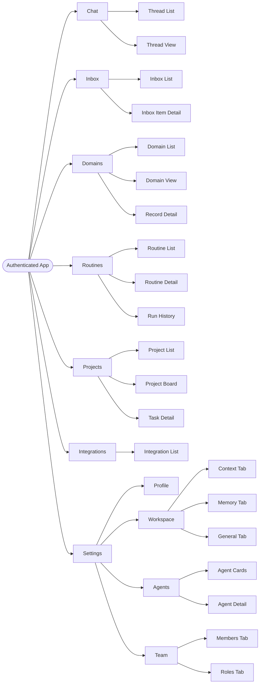

**Primary navigation** (left sidebar, always visible when authenticated):
Chat, Inbox, Domains, Routines, Projects, Integrations, Settings

**Secondary navigation** (within a section): tabs, back buttons, breadcrumbs — no full reloads.

---

## 2. Authentication Flow

### 2.1 Sign Up

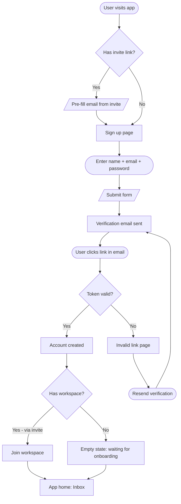

### 2.2 Sign In

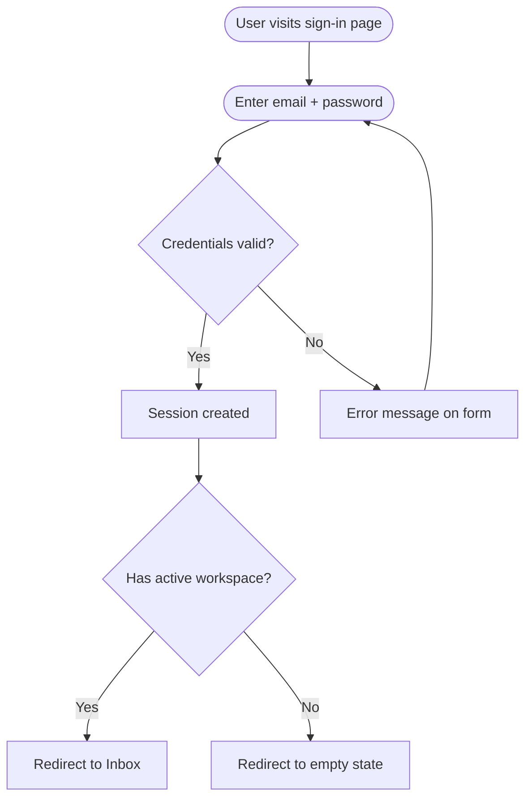

> **Edge cases:** Password reset flow (forgot password → email link → reset form → sign in). OAuth via Google: click Google button → redirect → authorize → return to app. Invalid/expired session: any authenticated route redirects to sign-in, returns to original route after.

---

## 3. Onboarding Flow

White-glove onboarding. The dpaperwork team prepares the workspace before the customer's first login. The customer's flow begins at "First login."

```mermaid
flowchart TD
    A([dpaperwork team creates workspace]) --> B[Seed default domains]
    B --> C[Seed default agent configs]
    C --> D[Seed empty CONTEXT.md + default role.md per agent]
    D --> E[Draft initial CONTEXT.md with customer info]
    E --> F[Send invite email to workspace owner]

    F --> G([Customer receives invite email])
    G --> H([Clicks invite link])
    H --> I[Sign up or sign in]
    I --> J[Welcome screen: brief product overview]
    J --> K([Click: Go to my workspace])
    K --> L[Inbox — empty but with welcome message from Chief of Staff]

    L --> M{Onboarding checklist visible}
    M --> N([Step 1: Review CONTEXT.md])
    N --> O[Settings → Workspace → Context]
    O --> P([Edit and save CONTEXT.md])
    P --> Q([Step 2: Connect first integration])
    Q --> R[Settings → Integrations]
    R --> S([Connect Gmail or Calendar])
    S --> T([Step 3: Review default domains])
    T --> U[Domains → Domain List]
    U --> V([Browse, edit, or accept defaults])
    V --> W([Step 4: Start first chat])
    W --> X[Chat → New Thread → Chief of Staff]
    X --> Y([Send first message])
    Y --> Z[Onboarding checklist complete]
    Z --> AA[Normal daily use]
```

> **Edge cases:** Customer skips steps (checklist dismissible after step 2). Customer completes steps out of order (checklist tracks completion, not sequence). Multiple admins from customer side — each needs to connect their own integrations (per-user OAuth). Workspace already partially set up by dpaperwork team before customer logs in (CONTEXT.md may already have content).
>
> **Empty states:** Welcome inbox item from Chief of Staff. Onboarding checklist in a dismissible banner until all steps complete.

---

## 4. Chat Flow

### 4.1 Create and send a message

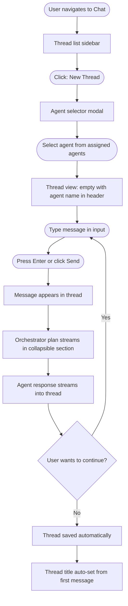

### 4.2 Manage a thread

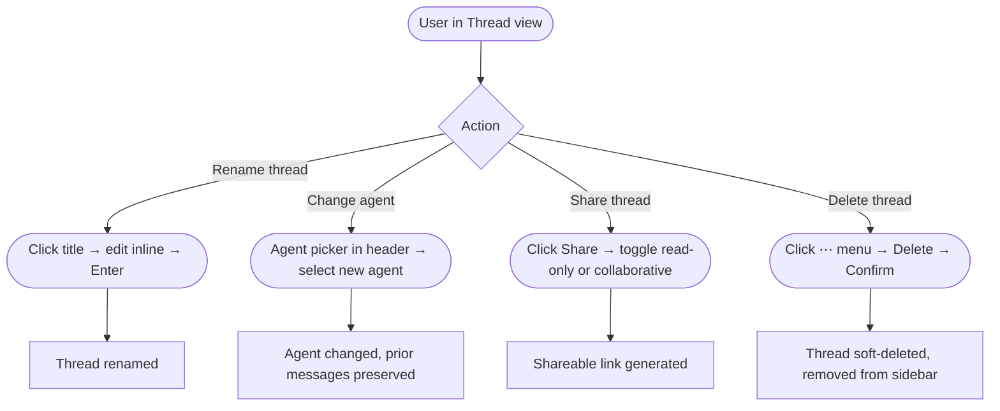

> **Edge cases:** Agent responds with a `cannot_complete` message (missing agent access or missing integration — message explains the gap). Long-running multi-step plans (streaming stays open until synthesis completes, progress visible per step). Network drop during streaming (show error, offer retry). User navigates away mid-stream (stream stops, partial response shown with warning banner).
>
> **Empty states:** No threads yet — full-bleed prompt: "Start a conversation with your AI team" with New Thread CTA. Thread list when only deleted threads exist — empty state.

---

## 5. Inbox Flow

### 5.1 Browse and act on inbox

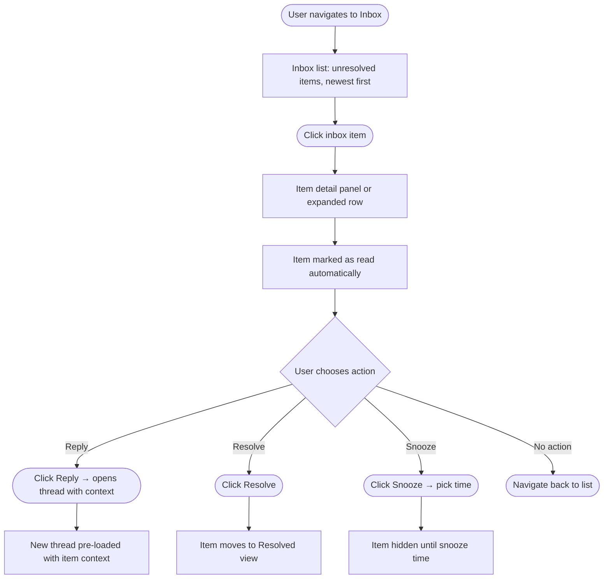

### 5.2 Filter inbox

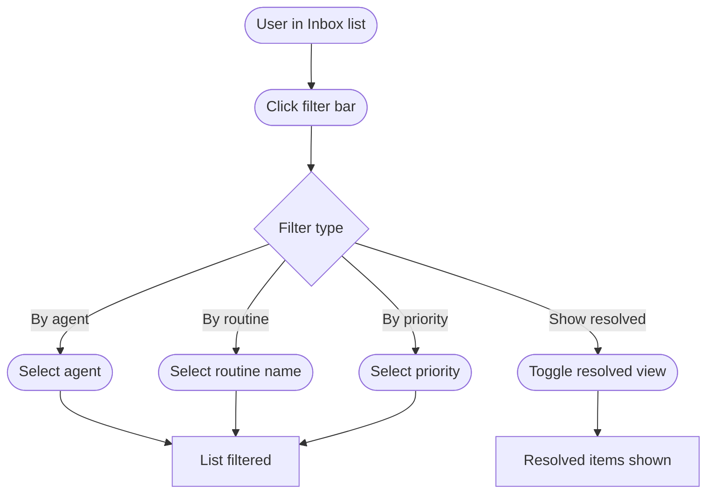

> **Edge cases:** Agent-initiated observations (not from routines) have no `source_routine_id` — shown with agent name only. Routine that produces an error surfaces as a special inbox item with error details and a link to the run log.
>
> **Empty states:** No inbox items — "Your AI team has nothing to report yet. Set up a routine to get weekly updates." Resolved-only view empty — "No resolved items."

---

## 6. Domains Flow

### 6.1 Create a new domain

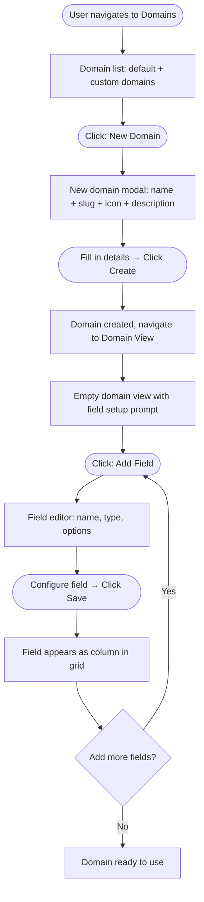

### 6.2 Add and edit records

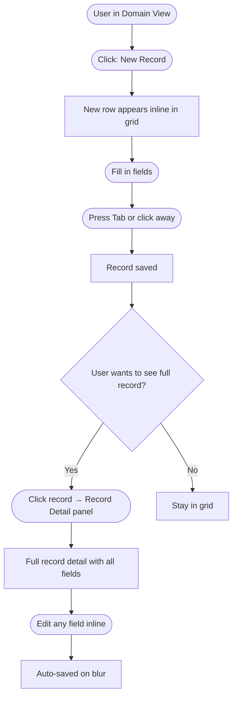

### 6.3 Change domain view

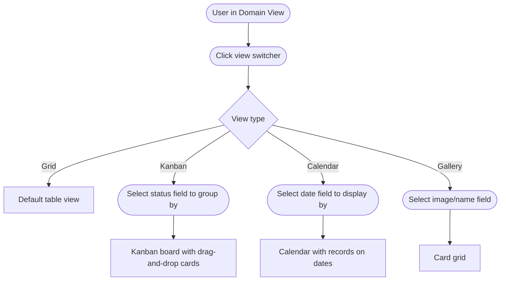

### 6.4 Edit domain schema

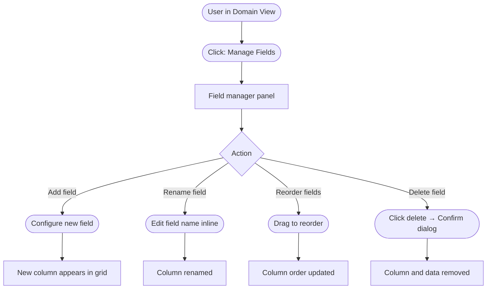

> **Edge cases:** Changing a field type (e.g., text → number) — UI warns that existing data in that column may not convert cleanly, requires explicit confirmation. Domain referenced by agents — deleting a domain shows warning: "Agents reference this domain in active routines." Concurrent edits to domain schema — last write wins, page auto-refreshes schema on conflict.
>
> **Empty states:** Domain list — default domains shown, plus "Create new domain" CTA. Empty domain view — "No records yet. Click New Record or wait for an agent to add data." Kanban view with no records in a column — empty column placeholder.

---

## 7. Routines Flow

### 7.1 Create a routine

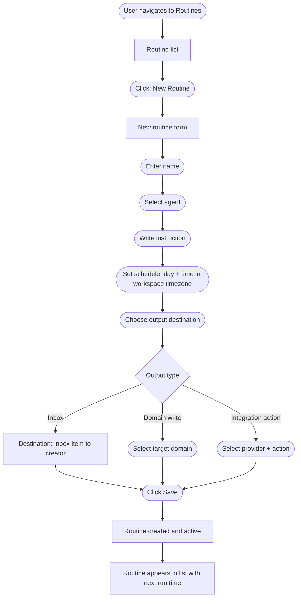

### 7.2 View routine detail and run history

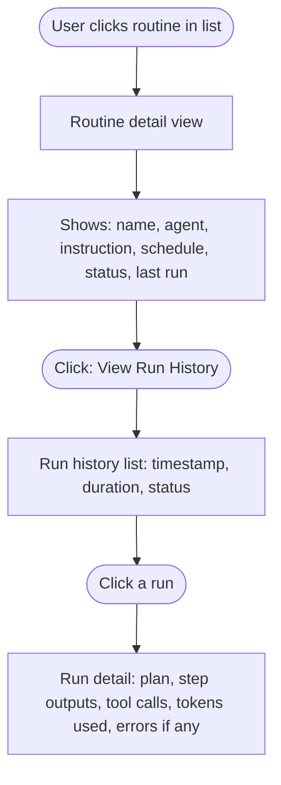

### 7.3 Edit and manage a routine

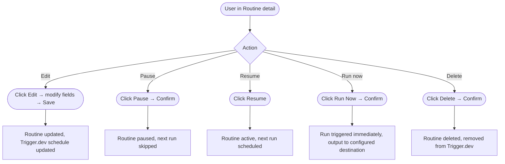

> **Edge cases:** Routine paused by system (OAuth revoked, budget exceeded) — shows `pause_reason` in detail view with actionable fix link. Run fails — inbox item created with error summary + link to run detail. "Run Now" while routine is already running — disabled, shows "Running..." state. Timezone changes to workspace — all routine schedules must be recomputed (app shows a banner after timezone change: "Your routine schedules have been updated to reflect the new timezone").
>
> **Empty states:** Routine list — "No routines yet. Set up a routine to get automated updates from your AI team." Run history — "This routine hasn't run yet."

---

## 8. Integrations Flow

### 8.1 Connect an integration

```mermaid
flowchart TD
    A([User navigates to Settings → Integrations]) --> B[Integration list: all available providers]
    B --> C[Each card shows: name, icon, connected/not connected]
    C --> D([Click: Connect on a provider])
    D --> E[OAuth redirect to provider login]
    E --> F([User authorizes in provider UI])
    F --> G[Redirect back to dpaperwork]
    G --> H{Auth successful?}
    H -->|Yes| I[Connection stored, card shows Connected + last sync]
    H -->|No| J[Error banner: "Connection failed — try again"]
    I --> K[Agents can now use this integration]
```

### 8.2 Manage an existing connection

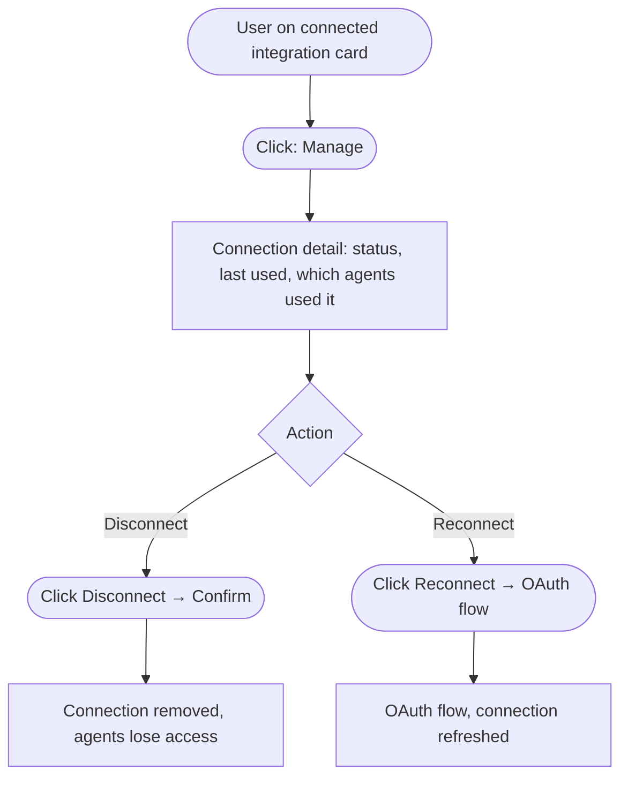

> **Edge cases:** Provider OAuth returns error (user denies, network failure) — return to integrations list with error toast. Token expiry — integration card shows "Expired" badge; user must reconnect. Disconnecting an integration used by active routines — warning modal: "2 routines use this integration and will pause if you disconnect."
>
> **Empty states:** No integrations connected — each card shows Connect CTA. Integration list — all cards visible whether connected or not.

---

## 9. Settings Flows

### 9.1 Edit CONTEXT.md

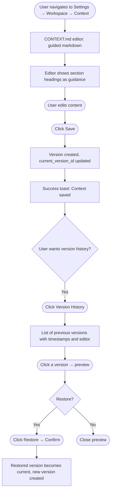

### 9.2 Edit workspace memory

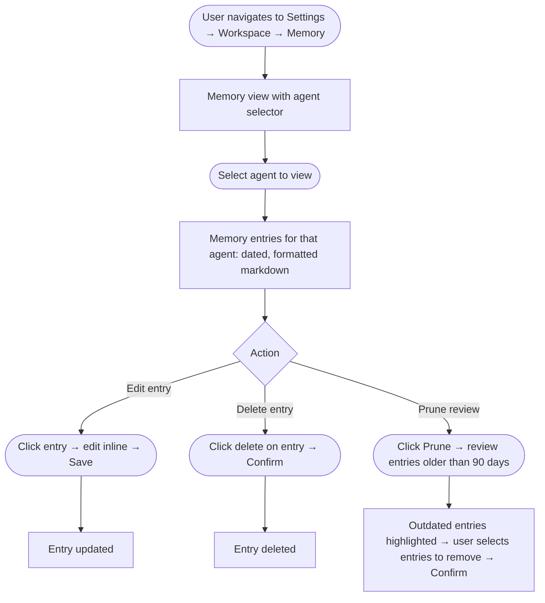

### 9.3 Configure an agent

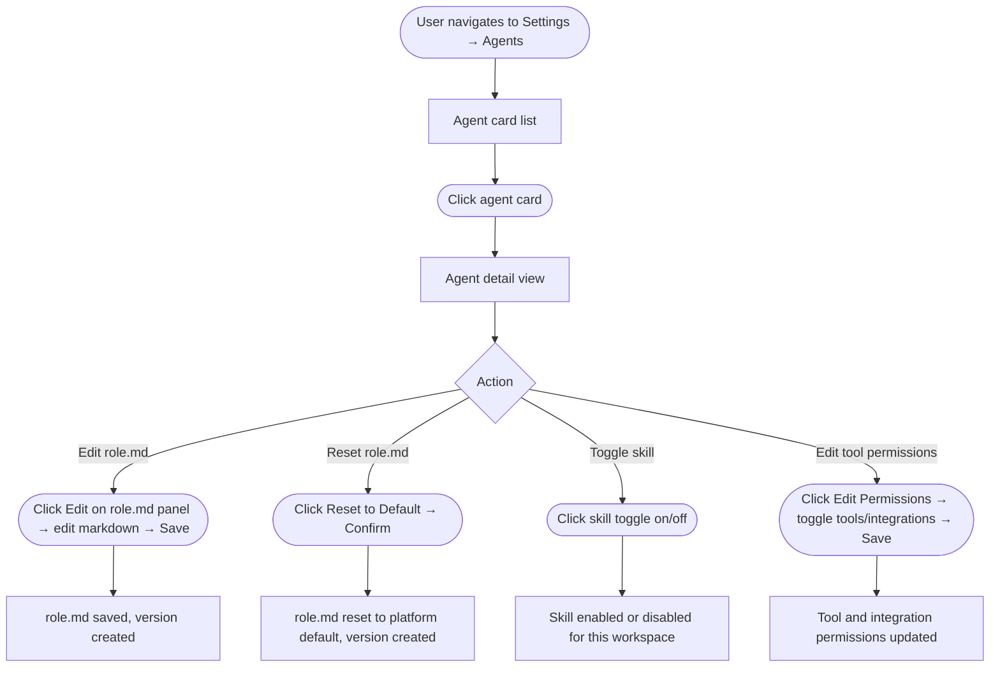

### 9.4 Manage team members

```mermaid
flowchart TD
    A([User navigates to Settings → Team → Members]) --> B[Members list: name, email, role, assigned agents, joined date]
    B --> C([Click: Invite Member])
    C --> D[Invite modal: email + role + agent assignments]
    D --> E([Fill in email])
    E --> F([Select role from workspace roles])
    F --> G([Select agents to assign])
    G --> H([Click Send Invite])
    H --> I[Invite email sent]
    I --> J[Member appears in list with Pending status]
    J --> K([Invitee accepts → Joins workspace])
    K --> L[Member status changes to Active]
```

### 9.5 Manage a member

```mermaid
flowchart TD
    A([User on member row in Members list]) --> B([Click: Manage])
    B --> C{Action}
    C -->|Change role| D([Role dropdown → select role → Save])
    C -->|Edit agent assignments| E([Agent checkboxes → toggle → Save])
    C -->|Remove member| F([Click Remove → Confirm])
    D --> G[Role updated]
    E --> H[Agent assignments updated]
    F --> I[Member soft-deleted, loses workspace access]
```

### 9.6 Manage roles

```mermaid
flowchart TD
    A([User navigates to Settings → Team → Roles]) --> B[Roles list: system roles + custom roles]
    B --> C([Click: New Role])
    C --> D[New role form: name + description]
    D --> E([Fill in name and description])
    E --> F([Set permissions: toggle per category])
    F --> G([Click Create])
    G --> H[Role created, appears in list]
    H --> I([Role can now be assigned to members via Members tab])
```

### 9.7 Edit or delete a role

```mermaid
flowchart TD
    A([User in Roles list]) --> B([Click role to open detail])
    B --> C[Role detail: name, description, permissions, members with this role]
    C --> D{Action}
    D -->|Edit| E([Edit name or permissions → Save])
    D -->|Delete| F{Any members assigned?}
    E --> G[Role updated, all members with this role inherit new permissions immediately]
    F -->|Yes| H[Block: Cannot delete, shows list of assigned members]
    F -->|No| I([Click Delete → Confirm])
    H --> J([User reassigns members to another role first])
    J --> F
    I --> K[Role deleted]
```

### 9.8 Edit profile

```mermaid
flowchart TD
    A([User navigates to Settings → Profile]) --> B[Profile form: name, email, avatar, timezone, language, notification prefs]
    B --> C([Edit fields])
    C --> D([Click Save])
    D --> E[Profile updated]
    E --> F{Email changed?}
    F -->|Yes| G[Verification email sent to new address]
    F -->|No| H[Success toast]
```

### 9.9 Edit workspace general settings

```mermaid
flowchart TD
    A([User navigates to Settings → Workspace → General]) --> B[General form: name, slug, timezone, language, working hours, branding]
    B --> C([Edit fields])
    C --> D([Click Save])
    D --> E{Timezone changed?}
    E -->|Yes| F[Routine schedules recomputed to new timezone]
    F --> G[Banner: Routine schedules updated]
    E -->|No| H[Settings saved]
    G --> H
```

> **Edge cases (Settings, all flows):** Editing role.md breaks agent behavior — user can always reset to default. System roles cannot be deleted or renamed (locked UI). Removing the last admin from a workspace is prevented — error: "Workspace must have at least one admin." Inviting an email that already has a workspace account — they join without needing to sign up. Role deletion when users are assigned — blocked with reassignment prompt. Timezone change mid-day — routines scheduled later that day are re-evaluated.
>
> **Empty states:** Memory tab — "No learnings recorded yet. Agents will update this as they work." Agent list — never empty (all three agents always visible). Members list — just the inviting admin initially.

---

## 10. Projects Flow

### 10.1 Browse and manage projects

```mermaid
flowchart TD
    A([User navigates to Projects]) --> B[Project list]
    B --> C([Click: New Project])
    C --> D[New project modal: name + description + default view]
    D --> E([Fill in → Click Create])
    E --> F[Project created, navigate to Project Board]
    F --> G[Default kanban view with starter columns]
```

### 10.2 Manage tasks on a project board

```mermaid
flowchart TD
    A([User in Project Board]) --> B{Action}
    B -->|Add task| C([Click + in column → enter title → Enter])
    B -->|Open task| D([Click task card])
    B -->|Move task| E([Drag card to new column])
    B -->|Assign task| F([Open task → assignee picker → select user or agent])
    C --> G[Task created in that column]
    D --> H[Task detail panel: title, description, assignee, due date, linked records]
    E --> I[Task status updated to new column]
    F --> J[Task assigned, assignee sees it in their view]
```

> **Edge cases:** Agent-owned task (e.g., "Chief of Staff: Draft board update") — task shows agent avatar, status updates when agent completes it. Agent task fails — task moves to a special "Needs review" state with error detail. Deleting a project with open tasks — confirm dialog warns about active tasks.
>
> **Empty states:** Project list — "No projects yet. Create a project or ask an agent to set one up." Project board with no tasks — empty columns with "+" CTA.

---

## 11. State Flows

### 11.1 Inbox item states

```mermaid
stateDiagram-v2
    [*] --> Unread: Agent creates item
    Unread --> Read: User opens item
    Read --> Resolved: User clicks Resolve
    Read --> Snoozed: User clicks Snooze
    Snoozed --> Unread: Snooze time expires
    Resolved --> [*]: Hard delete after retention period
    Unread --> [*]: User deletes manually
    Read --> [*]: User deletes manually
```

### 11.2 Routine states

```mermaid
stateDiagram-v2
    [*] --> Active: Routine created
    Active --> Paused: User pauses OR system pauses\n(OAuth revoked / budget exceeded)
    Paused --> Active: User resumes\n(and re-connects OAuth if needed)
    Active --> Deleted: User deletes
    Paused --> Deleted: User deletes
    Deleted --> [*]
```

### 11.3 Integration connection states

```mermaid
stateDiagram-v2
    [*] --> Connecting: User initiates OAuth
    Connecting --> Active: OAuth succeeds
    Connecting --> Error: OAuth fails
    Active --> Expired: Token expires
    Active --> Revoked: User disconnects
    Expired --> Active: User re-authenticates
    Error --> Active: User retries and succeeds
    Revoked --> [*]
```

### 11.4 Thread states

```mermaid
stateDiagram-v2
    [*] --> Active: Thread created
    Active --> Archived: User archives
    Archived --> Active: User unarchives
    Active --> Deleted: User deletes
    Archived --> Deleted: User deletes
    Deleted --> [*]
```

### 11.5 Domain record states

```mermaid
stateDiagram-v2
    [*] --> Active: Record created (by user or agent)
    Active --> Active: Updated (by user or agent)\nwrite logged in agent_writes_log
    Active --> Deleted: User soft-deletes\nOR agent deletes with attribution
    Deleted --> Active: User restores (within retention window)
    Deleted --> [*]: Hard delete after retention period
```

### 11.6 Workspace member states

```mermaid
stateDiagram-v2
    [*] --> Pending: Invite sent
    Pending --> Active: Invitee accepts
    Pending --> Expired: Invite link expires (7 days)
    Expired --> Pending: Admin resends invite
    Active --> Removed: Admin removes member
    Removed --> [*]
```

---

## 12. Full User Journey: First Week

End-to-end narrative of a founder using dpaperwork for the first time, tying all flows together.

```mermaid
flowchart TD
    A([Day 0: Receives invite email]) --> B[Signs up and logs in]
    B --> C[Sees welcome inbox item from Chief of Staff]
    C --> D([Reviews and edits CONTEXT.md — Onboarding Step 1])
    D --> E([Connects Gmail + Google Calendar — Onboarding Step 2])
    E --> F([Reviews default domains, renames Deals — Onboarding Step 3])
    F --> G([Starts first chat with Chief of Staff — Onboarding Step 4])
    G --> H[Onboarding complete]

    H --> I([Day 1: Creates weekly update routine])
    I --> J[Routine fires Monday 9am, summary in inbox]

    J --> K([Day 2: Invites ops lead via Settings → Team])
    K --> L[Ops lead assigned PM agent]

    L --> M([Day 3: Ops lead chats with PM to draft a spec])
    M --> N[PM uses draft_spec skill, produces PRFAQ]

    N --> O([Day 4: Founder reviews inbox, resolves weekly update])
    O --> P([Creates new domain: Experiments])

    P --> Q([Day 5: Chief of Staff routine fires, flags 2 stale deals])
    Q --> R([Founder updates deals in domain view])
    R --> S[End of first week: product in daily use]
```

---

## Appendix: Global Edge Cases and Empty States

Items that apply across multiple flows and don't belong to a single section.

**Global empty states**

- **First login (no workspace):** Full-screen "Your workspace is being set up" with contact info for the dpaperwork team.
- **No agents assigned to user:** Sidebar hides Chat, Inbox, Routines. Settings → Team shows a banner: "You have no agents assigned. Ask your admin."
- **No integrations connected:** Features that require integrations (email actions in skills) show inline prompts: "Connect Gmail in Settings → Integrations to enable this."

**Global error states**

- **Agent unreachable (LLM or Mastra error):** Chat shows "Something went wrong — try again" with a retry button. Routine run creates an inbox item with error detail.
- **Budget exceeded:** Chat shows "Daily limit reached — resets at midnight [workspace timezone]." Routines auto-pause.
- **Session expired:** Any page silently redirects to sign-in, returns to the original route after authentication.
- **No internet connection:** App shows offline banner, disables send/save actions, queues actions where safe.

**Global navigation edge cases**

- **Deep link to a thread the user doesn't own:** 404 if deleted, 403 if not shared.
- **Deep link to an agent the user isn't assigned:** Redirect to Chat with an explanatory toast.
- **Browser back/forward:** Sidebar selection and panel state respect browser history.
- **Mobile browser (not mobile app):** Responsive layout degrades gracefully — navigation collapses to hamburger, panels stack vertically. Mobile companion app is the full experience.
