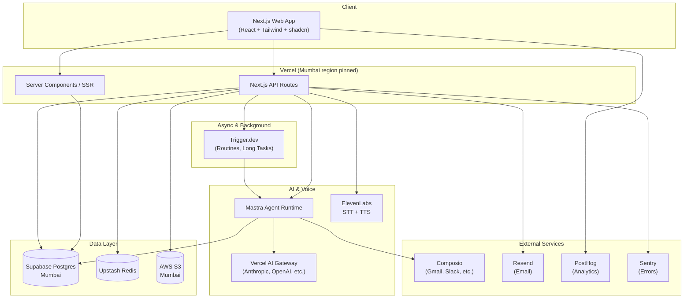
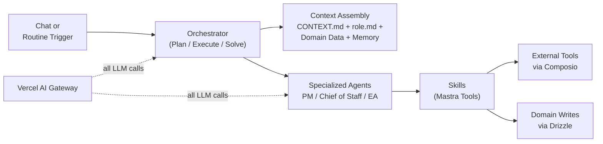
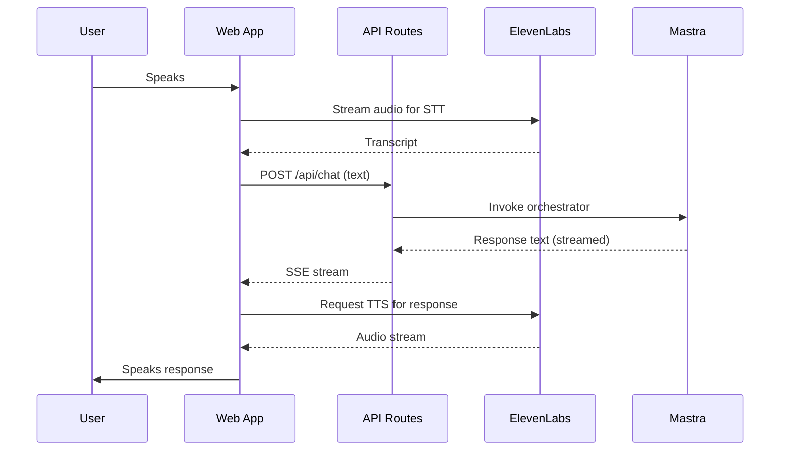
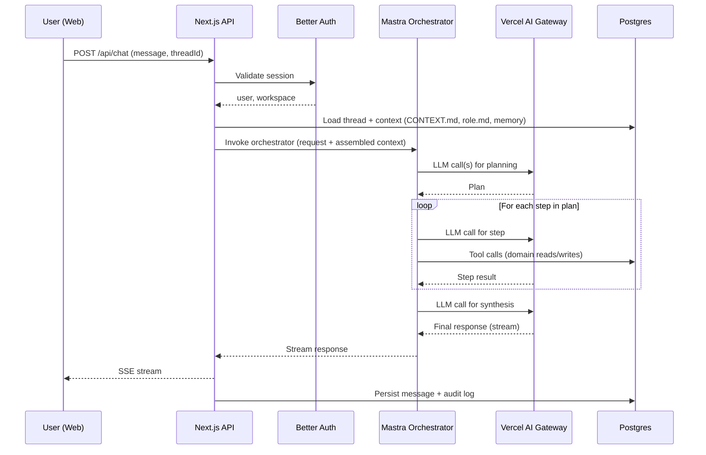
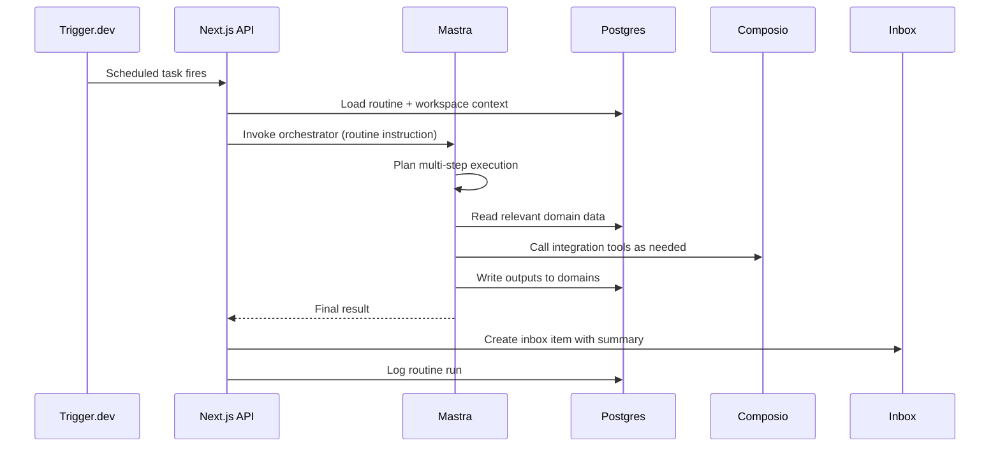

# dpaperwork — Architecture Document (Web App)

**Status:** Draft v0.1
**Owner:** [Founder]
**Last updated:** May 21, 2026

---

## 1. Overview & Scope

This document describes the technical architecture of the dpaperwork web application — the primary surface where tenants manage their workspace, configure agents, and interact with the platform.

**In scope**
- Web application architecture (Next.js)
- Backend services, data layer, caching, background jobs
- Integrations, voice, email, observability, security
- Multi-tenancy strategy
- Deployment, environments, CI/CD

**Out of scope**
- Mobile app architecture (separate document)
- Agent runtime internals — orchestration logic, planning, skill execution patterns (separate `Agent Runtime` document)
- Detailed database schema (separate `Backend Schema` document)
- Roadmap and sequencing (separate `Roadmap` document)

This document covers *what* the system looks like. The agent runtime doc covers *how* the AI layer thinks.

## 2. System Architecture



The architecture is a Next.js monolith on Vercel with a clear separation between synchronous request handling (API routes, server components) and asynchronous execution (Trigger.dev workers). The agent runtime (Mastra) is invoked from both paths — chat requests trigger short, interactive agent calls; routines trigger longer, multi-step agent workflows via Trigger.dev.

## 3. Technology Stack

| Layer | Choice | Notes |
|---|---|---|
| Frontend framework | Next.js (App Router) | API routes, not server actions |
| UI | Tailwind CSS + shadcn/ui | Standard component primitives |
| Client state / API | TanStack Query | All client-side fetching |
| Hosting | Vercel | Functions pinned to Mumbai (`bom1`) |
| Database | Supabase Postgres (Mumbai) | Postgres only — not using Supabase Auth/Realtime |
| ORM | Drizzle | TypeScript-native, lightweight migrations |
| Cache + rate limit + queues | Upstash Redis | Serverless, scales to zero |
| Background jobs | Trigger.dev | Long-running agent tasks, scheduled routines |
| File storage | AWS S3 (Mumbai) | Presigned URLs for client uploads |
| Auth | Better Auth | Email/password + OAuth |
| Agent runtime | Mastra | See separate Agent Runtime doc |
| Agent streaming (server) | `@mastra/ai-sdk` | `handleChatStream` + `createUIMessageStreamResponse` |
| Agent streaming (client) | `@ai-sdk/react` + `ai` | `useChat` with `DefaultChatTransport` |
| Chat UI components | AI Elements (`npx ai-elements@latest`) | `Conversation`, `Message`, `Tool`, `PromptInput` |
| LLM gateway | Vercel AI Gateway | Multi-provider routing |
| Voice STT/TTS | ElevenLabs | Multi-lingual including code-switching |
| Integrations | Composio | All third-party app integrations |
| Email | Resend + React Email | Transactional + notifications |
| Analytics | PostHog | Product analytics, optional self-host later |
| Error tracking | Sentry | Frontend + backend |
| Secrets | Env vars | Via Vercel env management |
| CI/CD | GitHub Actions | Tests, lint, deploy preview |

## 4. Hosting & Deployment

**Vercel** hosts the Next.js application. The team has prior experience with Vercel + Vercel AI Gateway, which weighed against the additional ops burden of self-hosting on AWS at this stage.

**Region pinning.** Vercel functions are pinned to Mumbai (`bom1`) via `vercel.json` and per-route region config. This is essential for two reasons:

- Latency: function-to-database round trips stay under 10ms when both sit in Mumbai. Without pinning, default routing can put functions in US East, adding 200ms+ per query.
- Data handling clarity: compute primarily executing in Mumbai is the closest practical statement of India residency Vercel allows on its current tiers.

**Environments**

- `production` — Vercel production deployment, custom domain.
- `staging` — separate Vercel project or production branch, mirrors prod infrastructure (separate Supabase project, separate Upstash, separate S3 bucket).
- `preview` — automatic per-PR deploys via Vercel. Uses shared dev resources, not prod data.
- `local` — developer machines using `.env.local`, pointing to dev Supabase and dev Upstash.

## 5. Application Layer

### Next.js App Router Structure

```
app/
  (auth)/           # Sign-in, sign-up, etc.
  (app)/            # Authenticated app shell
    chat/
    inbox/
    domains/
    projects/
    routines/
    integrations/
    settings/
  api/
    auth/[...]      # Better Auth handlers
    chat/[...]      # Chat endpoints
    domains/[...]   # Domains CRUD
    routines/[...]  # Routines CRUD
    webhooks/[...]  # Composio, Trigger.dev callbacks
  layout.tsx
  middleware.ts     # Auth, tenant resolution
```

**Server Components** handle initial render and data fetch where appropriate (settings pages, domain grids, inbox lists). They read directly from the database via Drizzle.

**API Routes** handle all mutations and data needs that arrive after first render (chat streaming via AI SDK v5, file uploads, polling). API routes are the canonical contract layer because the mobile app will consume the same APIs.

**Chat streaming** uses Mastra's AI SDK v5 integration via `@mastra/ai-sdk`. The server route uses `handleChatStream` and returns `createUIMessageStreamResponse`. The client uses `useChat` from `@ai-sdk/react` with `DefaultChatTransport`. Not raw SSE — the AI SDK v5 protocol handles progressive streaming of text chunks and tool call events in a standardised format.

**Server Actions are explicitly avoided.** API routes give clean contracts that mobile can reuse and make the request boundary visible for observability, rate limiting, and security review.

### Authentication

**Better Auth** handles session management. Sessions are stored in Postgres (Better Auth's default adapter). Auth flows:

- Email + password (primary for design partners)
- Google OAuth (for the founder-friendly workspaces)
- Magic links (deferred)

**Tenant resolution.** Every authenticated request runs through middleware that resolves `(user_id, workspace_id, role)` and attaches it to the request context. Every downstream query and operation is scoped by `workspace_id`. There is no code path that reads data without an explicit workspace scope.

### Middleware

`middleware.ts` runs on every request to:

- Validate session
- Resolve active workspace
- Enforce workspace membership
- Attach `(user, workspace, role)` to request headers for downstream handlers
- Apply rate limits (via Upstash)

## 6. Data Layer

### Postgres on Supabase (Mumbai)

Supabase provides managed Postgres in Mumbai with backups, point-in-time recovery, and connection pooling out of the box. We use **only Postgres + Storage** — not Supabase Auth, Realtime, or Edge Functions.

**Connection pooling.** Supabase exposes a PgBouncer pooler in transaction mode. Drizzle works with this cleanly because it does not rely on prepared statements by default. The pooler URL (port 6543) is used for all serverless function connections; direct connections (port 5432) are reserved for migrations and Trigger.dev workers that hold persistent connections.

### Drizzle ORM

Drizzle is the single ORM. Schema is defined as TypeScript files in `db/schema/`. Migrations are generated via `drizzle-kit` and committed to the repo. All schema details live in the separate Backend Schema document; here, we cover the *strategy*:

- Every table that holds tenant data has a `workspace_id` column with a foreign key to `workspaces`.
- All queries go through a `db` helper that enforces workspace scoping at the query-builder level. Direct unscoped queries are caught by code review.
- Soft deletes (`deleted_at`) for user-facing entities (threads, inbox items, routines). Hard deletes for high-volume internal data (logs, run history).

### Multi-Tenancy Strategy

**Single Postgres database, shared schema, `workspace_id` discipline.** This is the simplest model and the right one for the validation phase.

Trade-offs accepted:
- Per-tenant performance isolation is limited. One noisy tenant can affect others. Mitigation: query budgets, rate limits, observability per tenant.
- Backups are workspace-spanning. Restoring one tenant's data requires careful filtering.
- Schema changes affect all tenants simultaneously. Mitigation: backwards-compatible migration discipline.

A future move to schema-per-tenant or database-per-tenant is possible but not planned. The first migration is more likely to be Supabase → managed Postgres (RDS Mumbai or comparable), keeping the shared-schema model.

### File Storage on S3 (Mumbai)

S3 in Mumbai region holds:
- User uploads attached to domain records, threads, projects
- Generated artifacts (agent-authored documents, reports)
- CONTEXT.md exports and version history snapshots

**Access pattern.** Client requests a presigned upload URL from the API, uploads directly to S3, then notifies the API of the upload. Downloads use presigned read URLs scoped to the requesting user's workspace. There is no public bucket access.

**Lifecycle.** Audit and run-history attachments are moved to S3 Glacier after 90 days. User-facing files have no lifecycle rule (kept until explicitly deleted).

## 7. Caching & Rate Limiting

**Upstash Redis** is the single Redis instance, used for:

- **Session caching.** Better Auth session lookups cached for the session lifetime. Reduces Postgres reads on every request.
- **Rate limiting.** Per-user, per-workspace, and per-endpoint limits via Upstash's rate-limit primitives. Applied in middleware.
- **Idempotency keys.** Webhook handlers (Composio, Trigger.dev) use Redis-backed idempotency keys to dedupe retries.
- **Short-lived computed data.** Things like "active routines summary for the dashboard view" cached for 30-60 seconds.

**What is *not* cached in Redis:** domain data, CONTEXT.md, role.md, memory. These are read directly from Postgres because they change in patterns that make cache invalidation hard to reason about. If hot paths emerge, targeted caching can be added.

Upstash was chosen over self-hosted Redis because the cost difference at the validation stage is negligible and the operational burden of self-hosting Redis correctly (persistence, monitoring, failover) is not worth taking on yet.

## 8. Background Jobs

**Trigger.dev** runs all asynchronous work. Two categories:

**Scheduled routines.** Each tenant routine corresponds to a Trigger.dev scheduled task. When a tenant creates a routine in the UI, the API registers a schedule with Trigger.dev. When the schedule fires, the task invokes the agent runtime with the routine's instruction and writes the output to the destination (inbox, domain, integration action).

**Long-running agent tasks.** Multi-step agent workflows that exceed serverless function time limits (60s on Vercel Pro) are dispatched to Trigger.dev. The API route accepts the request, creates a task, and returns a task ID. The client polls or subscribes for completion.

Trigger.dev was chosen over Inngest, BullMQ, and AWS-native alternatives because:
- It has first-class Next.js integration
- The developer experience is closer to writing application code than configuring infrastructure
- Built-in observability for task runs

**Concurrency and limits.** Trigger.dev plans have concurrent execution caps. Per-workspace concurrency limits are enforced in application code on top of Trigger.dev's global concurrency, so a single tenant cannot consume all available workers.

**Routine identity.** Every scheduled routine task runs as its creator. The task payload includes `(workspace_id, routine_id, creator_user_id)`, and the agent runtime uses the creator's Composio connections for any integration calls. See Section 11 for the full per-user OAuth model and its consequences for routine reliability.

## 9. Agent Runtime (Overview)

**Detailed design is covered in the separate Agent Runtime document.** This section is a high-level summary so the rest of the architecture makes sense.



**Mastra** is the runtime. Specialized agents and skills are defined as Mastra primitives. The orchestrator follows a **plan → execute → solve** pattern: decompose the request into steps, execute each step (potentially calling specialized agents and tools), synthesize a final response.

**Vercel AI Gateway** sits between Mastra and the LLM providers. This gives:
- Multi-provider routing (Anthropic, OpenAI, others) without provider lock-in
- Centralized observability for LLM calls
- Cost and latency tracking per call

**Boundary between Mastra and application code.** Mastra owns agent/skill execution mechanics. Application code owns context assembly, persistence, audit logging, and tenant scoping. This boundary matters: if Mastra changes direction, our business logic is portable.

**Skills as code.** Each skill is a Mastra tool/workflow. The platform ships a library of skills. New skills are added based on customer needs encountered during white-glove onboarding. A skill enters the platform library only if it can be expressed as a generic capability parameterized by CONTEXT.md, domains, and role.md — anything truly customer-specific is handled via prompt-level customization, not bespoke code.

## 10. Voice

**ElevenLabs** provides both STT (speech-to-text) and TTS (text-to-speech). Multi-lingual is a first-class requirement; ElevenLabs supports the languages targeted (English, Hindi, plus prioritized Indian regional languages).

**Code-switching** (Hindi-English mixed speech, common in Indian business contexts) is a real concern. ElevenLabs' multilingual models handle this acceptably, but quality must be validated with the design-partner cohort.

**Voice flow.**



For the web app, voice is positioned as an accessibility and convenience feature. The hands-free use case is mobile-first and will be designed in the mobile architecture doc.

## 11. Integrations (Composio)

**Composio** is the integration layer for all third-party apps (Gmail, Google Calendar, Slack, Outlook, etc.). The decision to centralize through Composio avoids building OAuth flows, token refresh, and API quirks per provider.

**Per-user connections (v1 scope).** Each user connects their own accounts. There is no workspace-level shared connection. When an agent acts on behalf of a user (a chat interaction), it uses that user's OAuth tokens via Composio's user-entity model. We store only the Composio connection identifier per user; tokens never touch our database.

**Implication for cross-user operations.** In v1, agents cannot perform team-wide operations (e.g., "summarize the entire team's calendar this week") unless every relevant team member has connected the necessary integration. This is documented as a known v1 limitation, with per-workspace integrations planned as a v2 capability based on customer feedback.

**Per-agent permission flags.** Each agent has a configurable list of which integration types it may call (e.g., PM can use Gmail and Slack; Chief of Staff can use Gmail, Slack, and Calendar). Stored in our DB, enforced in application code before any Composio call. Actual access for a given (user, agent) pair is the intersection of "agent allowed to use X" AND "user has connected X."

**Routine OAuth ownership.** Every routine has a creator. When a routine fires, it executes using the creator's Composio connections — there is no anonymous service identity for routines in v1. Consequences:
- If the creator's connection is revoked, the routine pauses and notifies the workspace admin.
- If the creator leaves the workspace, the routine pauses; an admin can either reassign it to another user (who must have the necessary connections) or delete it.
- This trade-off is acceptable in v1 because routines are still early in customer adoption and the alternative (workspace-owned service identity) introduces privacy and audit complications we want to defer.

**Webhook handling.** Composio webhooks (e.g., new email received, calendar event created) hit `/api/webhooks/composio` on Next.js. Webhooks include a Composio entity identifier that maps back to a `(workspace_id, user_id)` pair. Webhooks are deduped via Redis idempotency keys and persisted to Postgres before any further processing. Webhook-driven agent invocations are dispatched to Trigger.dev.

## 12. Email

**Resend + React Email** handles all outbound email:

- Authentication emails (verification, password reset) — driven by Better Auth
- Notification emails (digest of inbox items, routine completion summaries for users who opt in)
- Transactional emails (invoices, onboarding sequences)

Email templates are React components in `emails/` and rendered via React Email at send time. This keeps copy and design in code review rather than a third-party template editor.

## 13. Observability

**PostHog** (product analytics)
- Client-side: page views, feature usage, funnel events
- Server-side: API events when relevant (routine created, agent invoked, integration connected)
- Identification: tied to `user_id` and `workspace_id` on every event
- Self-hosting is an option later if usage volume warrants

**Sentry** (error tracking)
- Frontend errors (Next.js Sentry SDK)
- Backend errors (API routes, server components, Trigger.dev tasks)
- Source maps uploaded via CI
- Errors tagged with `workspace_id` to enable per-tenant error rate tracking
- **Plan:** Sentry free tier (5K errors/month). To stay within quota, filtering is aggressive: known noise (network aborts, cancelled requests, third-party script errors) is dropped at the SDK level; non-critical errors are sampled at 10%; only novel error signatures trigger alerts. Trade-off accepted: at scale or during incident spikes, errors may be dropped silently when quota is exceeded. Upgrade path to Team plan ($26/month) is open if the free quota becomes a blocker.

**Logging strategy**
- Structured logs (JSON) from API routes and background tasks
- Logs include `request_id`, `user_id`, `workspace_id`, `route`, `duration_ms`
- Vercel logs for HTTP requests; Trigger.dev logs for background tasks
- Centralized log aggregation (e.g., Axiom, Logtail) deferred until needed — Vercel + Trigger.dev native UIs are sufficient through validation

**Agent observability** specifically — tool call traces, orchestrator plans, skill invocations — is covered in the Agent Runtime document because it's runtime-specific.

## 14. Security

**Authentication.** Better Auth with secure session cookies (HTTP-only, SameSite=Lax, Secure in production). Sessions stored server-side in Postgres.

**Authorization.** Three layers:
- Workspace membership (user must belong to the workspace)
- Role (Admin / Member; configurable roles in future)
- Per-user agent assignment (separately enforced for agent-related routes)

Every API route validates all three before serving data.

**Secrets.** Environment variables managed in Vercel. No secrets in repo. Pre-commit hooks (`gitleaks` or similar) prevent accidental commits. Different secret sets per environment.

**Audit logging.** All agent writes to domains, all integration actions, all routine runs are recorded with attribution: `(workspace_id, actor_type, actor_id, action, target, timestamp, metadata)`. Audit log is append-only and read-only via the application.

**Data encryption.** At rest: Supabase Postgres (encrypted by default), S3 (SSE-S3 enabled). In transit: TLS everywhere; no plaintext channels.

**Multi-tenant isolation.** Enforced exclusively in application code via `workspace_id` scoping. There is no Postgres RLS (Row-Level Security) layer for now — RLS adds complexity that doesn't fit the validation phase, and our query layer enforces scoping consistently. RLS may be added later for defense in depth.

**Composio tokens.** OAuth tokens for third-party integrations are stored in Composio, not in our DB. We hold only Composio connection IDs. Reduces blast radius of a database compromise.

## 15. Environments & CI/CD

**GitHub Actions** runs on every PR:
- Lint (ESLint, Prettier)
- Type check (TypeScript)
- Unit tests
- Drizzle schema validation (no pending uncommitted migrations)
- Build (catches Next.js build errors before deploy)

**Vercel** handles deployment:
- PR previews automatic on every push
- Production deploys on merge to `main` (or release tag, TBD)
- Environment variables managed in Vercel UI per environment

**Database migrations** are auto-applied on production deploy. The Drizzle migration files committed to the PR are applied as part of the GitHub Actions deploy job, before the Vercel deploy promotes. Safety nets:
- PR checks fail if generated SQL is not committed alongside schema changes (no drift between schema files and migrations)
- Migrations are required to be backwards-compatible with the previous app version (additive changes only; destructive changes use a two-step migrate pattern: deploy code that tolerates both shapes, then deploy migration)
- Rollback procedure documented in the runbook: revert the deploy, then manually roll back the migration if needed

## 16. Key Data Flows

### Chat Request



### Scheduled Routine



## 17. Known Tradeoffs & Future Migration Paths

**Supabase Postgres → managed Postgres (post-validation).** Supabase is the right choice for validation: managed, in Mumbai, low cost. Post-validation, options include AWS RDS Postgres Mumbai (boring, well-understood), Neon (branching workflows), or PlanetScale Postgres (newer offering). RDS Mumbai is the default candidate; others to be evaluated based on operational needs at the time.

**Upstash Redis → ElastiCache or self-hosted (at scale).** Upstash pricing scales with request volume and gets expensive past a certain throughput. ElastiCache Mumbai is the likely migration path if Redis usage becomes hot.

**Vercel → self-hosted (if needed).** Vercel is the right call for now given team familiarity and speed-to-ship. If data residency requirements harden (e.g., a customer requires strict India-only compute), or if pricing becomes unfavorable at scale, the path is self-hosted Next.js on AWS Mumbai (ECS Fargate or EC2 + ALB). OpenNext is the open-source bridge that makes this practical without rewriting.

**S3 → Supabase Storage (or vice versa).** Currently S3 for files. If storage and DB co-location matters more than S3's maturity, Supabase Storage in Mumbai is a clean alternative. Trade-offs as previously discussed.

**No Postgres RLS for now.** Application-layer enforcement of multi-tenancy is sufficient at this stage. RLS adds defense-in-depth but also complexity that slows development. Likely to be added once the schema stabilizes.

**Single shared database.** No tenant isolation at the database level. Acceptable for validation. The first dramatic scale-up event would likely involve sharding by workspace_id or moving large tenants to dedicated databases, but this is speculative.

**Per-user Composio OAuth only (v1).** No workspace-shared integration connections. Cross-user / team-wide agent operations are not supported in v1 — they require every relevant user to have connected the needed integrations. v2 will add per-workspace integration scope based on which use cases customers actually need. The integration connections table includes a `scope` column (`user` | `workspace`) from day one with `user_id` nullable; v1 only writes `scope = 'user'` rows, but the schema supports v2 expansion without migration.

---

## Appendix: Open Questions

These are technical decisions that don't block the architecture overall but need answers during build:

- Webhook signature verification details per integration (Composio, Trigger.dev, Resend) — standardize via a shared verification helper
- PostHog session replay — enable for design-partner accounts only, or opt-in per tenant
- Error handling UX — global error boundary in Next.js, but what's the user-facing fallback for agent failures specifically?
- Routine reassignment UX — when a routine's creator leaves the workspace, should the admin reassign manually, or should we auto-suggest a reassignment candidate?
