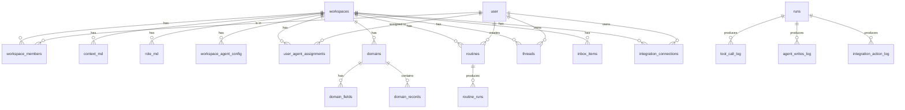

# dpaperwork — Backend Schema Document

**Status:** Draft v0.1
**Owner:** [Founder]
**Last updated:** May 21, 2026

---

## 1. Overview & Scope

This document specifies the Postgres schema for dpaperwork. It is the canonical reference for table structure, column types, relationships, indexes, and migration discipline.

**In scope**
- Conventions: IDs, timestamps, soft deletes, multi-tenancy, naming
- All application-owned tables and their relationships
- How Mastra's tables coexist with ours
- Drizzle ORM definitions as the source of truth
- Indexes and performance notes
- Migration workflow

**Out of scope**
- Application code patterns (covered in Architecture document)
- Agent runtime internals (covered in Agent Runtime document)
- Mobile-specific tables (deferred with mobile architecture)
- Frontend state shape

The schema is implemented in TypeScript via Drizzle ORM. Migrations are generated by `drizzle-kit` and committed to the repo. Drizzle definitions in this document match what should be in `db/schema/`.

## 2. Conventions

### 2.1 Identifiers

All IDs are **prefixed string IDs**, Stripe-style. Format: `{prefix}_{nanoid}` where `nanoid` is a 16-character URL-safe random string.

| Entity | Prefix | Example |
|---|---|---|
| Workspace | `ws_` | `ws_a1b2c3d4e5f6g7h8` |
| User | `usr_` | `usr_x1y2z3w4v5u6t7s8` |
| Workspace member | `mem_` | `mem_...` |
| Role | `rol_` | `rol_...` |
| Thread | `thr_` | `thr_...` |
| Inbox item | `inb_` | `inb_...` |
| Routine | `rtn_` | `rtn_...` |
| Routine run | `rrn_` | `rrn_...` |
| Run (agent execution) | `run_` | `run_...` |
| Domain | `dom_` | `dom_...` |
| Domain record | `rec_` | `rec_...` |
| Integration connection | `icn_` | `icn_...` |
| Context/role version | `ver_` | `ver_...` |
| Tool call log | `tcl_` | `tcl_...` |
| Agent write log | `awl_` | `awl_...` |

Rationale: grepping logs and tracing issues is dramatically easier when IDs carry type information. Worth the 4-byte cost per ID.

Generation: nanoid library, application-side. IDs are immutable once written.

### 2.2 Timestamps

- Every table has `created_at` and `updated_at` columns.
- Type: `timestamp with time zone` (`timestamptz` in Postgres).
- Defaulted to `now()` at insert time. `updated_at` maintained by application code (Drizzle's `.$onUpdate(() => new Date())` pattern).
- All timestamps stored in UTC. Application converts to workspace timezone for display.

### 2.3 Soft deletes

Applied selectively. Tables with user-facing recovery value get a `deleted_at timestamptz` column; deletes are soft, queries filter `WHERE deleted_at IS NULL`.

Tables with soft delete: `workspaces`, `workspace_members`, `threads`, `inbox_items`, `routines`, `domains`, `domain_records`, `integration_connections`.

Tables with hard delete: all audit logs, all version history tables (no need to "undelete" versions), `runs`, `usage_daily`, Mastra-managed tables.

### 2.4 Multi-tenancy

Every tenant-owned table has a `workspace_id text not null` column with a foreign key to `workspaces.id`. Application code scopes every query by `workspace_id` via a `db` helper that enforces it at the query-builder level.

We do **not** add cross-table workspace_id check constraints (too brittle). We do **not** use Postgres Row-Level Security in v1 (covered in Architecture doc — application-layer enforcement is the v1 strategy).

### 2.5 Naming

- Table names: `snake_case`, plural (`workspaces`, `domain_records`)
- Column names: `snake_case` in Postgres; Drizzle maps to camelCase in TypeScript
- Foreign key columns: `{referenced_table_singular}_id` (`workspace_id`, `user_id`)
- Boolean columns: positive phrasing (`is_active`, `is_paused`, not `not_active`)
- JSON columns: use `jsonb` always (not `json`). Suffix with `_json` only when ambiguity exists; otherwise the column name speaks for itself (`fields`, `args`, `result`)

### 2.6 Indexes

- All foreign keys get indexes (Postgres does not auto-index FKs)
- All `workspace_id` columns get composite indexes with the next-most-queried column (`(workspace_id, created_at)`, `(workspace_id, status)`)
- JSON columns that are filter targets get GIN indexes on specific paths
- Documented in each table section

### 2.7 Drizzle file organization

```
db/
  schema/
    auth.ts            # Better Auth tables (extended)
    workspace.ts       # workspaces, members, settings
    content.ts         # context_md, role_md, versions
    agents.ts          # workspace_agent_config, user_agent_assignments
    domains.ts         # domains, domain_fields, domain_records
    routines.ts        # routines, routine_runs
    chat.ts            # threads, inbox_items
    integrations.ts    # integration_connections, agent_integration_permissions
    audit.ts           # tool_call_log, agent_writes_log, integration_action_log
    runs.ts            # runs (execution state persistence)
    usage.ts           # usage_daily
    index.ts           # re-exports
  migrations/
    {timestamp}_{name}.sql
  client.ts            # Drizzle client setup
```

Each schema file exports its tables and (where useful) relations. `index.ts` re-exports for the rest of the application.

## 3. Schema Overview (high-level ER)



(Detailed ER diagrams per section below.)

## 4. Authentication & Users

Better Auth manages auth tables. We use Better Auth's `user` table as our canonical user record, extended with our application-specific fields via Better Auth's extension API.

### 4.1 Tables managed by Better Auth

Better Auth creates and maintains four tables in the `public` schema:

- `user` — user identity and profile
- `session` — active sessions with expiry
- `account` — OAuth provider accounts linked to users (Google, etc.)
- `verification` — email verification, password reset tokens

We do not author or migrate these directly. Better Auth handles their schema and updates them on package upgrades.

### 4.2 Extended user fields

We extend Better Auth's `user` table with dpaperwork-specific fields via Better Auth's `additionalFields` configuration:

```typescript
// db/schema/auth.ts
import { pgTable, text, timestamp, boolean } from 'drizzle-orm/pg-core';

// Better Auth's user table — extended via Better Auth config; this declaration
// reflects the final shape after extension. Treat Better Auth as the migration
// owner for the base columns; our extension fields are added via Better Auth's
// `user.additionalFields` option.
export const user = pgTable('user', {
  id: text('id').primaryKey(),
  email: text('email').notNull().unique(),
  emailVerified: boolean('email_verified').notNull().default(false),
  name: text('name').notNull(),
  image: text('image'),
  createdAt: timestamp('created_at', { withTimezone: true }).notNull(),
  updatedAt: timestamp('updated_at', { withTimezone: true }).notNull(),

  // dpaperwork extensions
  timezone: text('timezone').notNull().default('Asia/Kolkata'),
  language: text('language').notNull().default('en'),
  notificationsEmailEnabled: boolean('notifications_email_enabled').notNull().default(true),
});
```

**Indexes**: Better Auth manages indexes on `email`, `id`. No additional indexes needed.

### 4.3 User IDs

Better Auth generates user IDs as nanoid strings without prefixes. We don't change this — Better Auth owns the `user.id` format. Application code that constructs IDs for joining/logging knows that user IDs are bare nanoids (no `usr_` prefix) and treats them accordingly. This is the one exception to the prefix-ID convention; the alternative (overriding Better Auth's ID generation) creates more friction than it's worth.

## 5. Workspaces & Membership

### 5.1 Tables

```typescript
// db/schema/workspace.ts
import { pgTable, text, timestamp, integer, boolean, index, uniqueIndex } from 'drizzle-orm/pg-core';
import { user } from './auth';

export const workspaces = pgTable('workspaces', {
  id: text('id').primaryKey(),                            // ws_...
  name: text('name').notNull(),
  slug: text('slug').notNull(),
  timezone: text('timezone').notNull().default('Asia/Kolkata'),
  planTier: text('plan_tier', { enum: ['design_partner', 'standard'] }).notNull().default('design_partner'),
  dailyBudgetTokens: integer('daily_budget_tokens').notNull().default(200_000),

  // General settings
  workingHoursStart: text('working_hours_start'),         // "09:00"
  workingHoursEnd: text('working_hours_end'),             // "18:00"
  language: text('language').notNull().default('en'),
  brandingLogoS3Key: text('branding_logo_s3_key'),
  brandingPrimaryColor: text('branding_primary_color'),

  // Default agent for new threads
  defaultAgentId: text('default_agent_id', { enum: ['pm', 'chief-of-staff', 'executive-assistant'] }),

  createdAt: timestamp('created_at', { withTimezone: true }).notNull().defaultNow(),
  updatedAt: timestamp('updated_at', { withTimezone: true }).notNull().defaultNow().$onUpdate(() => new Date()),
  deletedAt: timestamp('deleted_at', { withTimezone: true }),
}, (table) => ({
  slugUnique: uniqueIndex('workspaces_slug_unique').on(table.slug).where(sql`deleted_at IS NULL`),
}));

export const workspaceMembers = pgTable('workspace_members', {
  id: text('id').primaryKey(),                            // mem_...
  workspaceId: text('workspace_id').notNull().references(() => workspaces.id),
  userId: text('user_id').notNull().references(() => user.id),
  role: text('role', { enum: ['admin', 'member'] }).notNull().default('member'),
  invitedByUserId: text('invited_by_user_id').references(() => user.id),
  joinedAt: timestamp('joined_at', { withTimezone: true }).notNull().defaultNow(),
  createdAt: timestamp('created_at', { withTimezone: true }).notNull().defaultNow(),
  updatedAt: timestamp('updated_at', { withTimezone: true }).notNull().defaultNow().$onUpdate(() => new Date()),
  deletedAt: timestamp('deleted_at', { withTimezone: true }),
}, (table) => ({
  workspaceUserUnique: uniqueIndex('workspace_members_workspace_user_unique')
    .on(table.workspaceId, table.userId)
    .where(sql`deleted_at IS NULL`),
  workspaceIdx: index('workspace_members_workspace_idx').on(table.workspaceId),
  userIdx: index('workspace_members_user_idx').on(table.userId),
}));
```

### 5.2 Notes

- `slug` is unique among non-deleted workspaces (partial unique index).
- `default_agent_id` allows null because a workspace may not have set one yet.
- Two roles only in v1: `admin` and `member`. Future role expansion is additive.
- Soft delete: deleting a workspace marks it deleted but preserves data for recovery. Members are also soft-deleted when a workspace is deleted (cascade in application code, not DB).

## 6. Tenant Content (CONTEXT.md & role.md)

Stored in Postgres with full version history. Current version is the latest row in the versions table; we also denormalize to a "current" table for fast reads.

### 6.1 Tables

```typescript
// db/schema/content.ts
import { pgTable, text, timestamp, integer, index, uniqueIndex } from 'drizzle-orm/pg-core';
import { workspaces } from './workspace';
import { user } from './auth';

export const contextMd = pgTable('context_md', {
  workspaceId: text('workspace_id').notNull().references(() => workspaces.id).primaryKey(),
  content: text('content').notNull().default(''),
  currentVersionId: text('current_version_id').notNull(),  // ver_...
  updatedByUserId: text('updated_by_user_id').references(() => user.id),
  createdAt: timestamp('created_at', { withTimezone: true }).notNull().defaultNow(),
  updatedAt: timestamp('updated_at', { withTimezone: true }).notNull().defaultNow().$onUpdate(() => new Date()),
});

export const contextMdVersions = pgTable('context_md_versions', {
  id: text('id').primaryKey(),                            // ver_...
  workspaceId: text('workspace_id').notNull().references(() => workspaces.id),
  content: text('content').notNull(),
  createdByUserId: text('created_by_user_id').references(() => user.id),
  createdAt: timestamp('created_at', { withTimezone: true }).notNull().defaultNow(),
}, (table) => ({
  workspaceCreatedIdx: index('context_md_versions_workspace_created_idx')
    .on(table.workspaceId, table.createdAt.desc()),
}));

export const roleMd = pgTable('role_md', {
  workspaceId: text('workspace_id').notNull().references(() => workspaces.id),
  agentId: text('agent_id', { enum: ['pm', 'chief-of-staff', 'executive-assistant'] }).notNull(),
  content: text('content').notNull(),
  currentVersionId: text('current_version_id').notNull(),
  updatedByUserId: text('updated_by_user_id').references(() => user.id),
  createdAt: timestamp('created_at', { withTimezone: true }).notNull().defaultNow(),
  updatedAt: timestamp('updated_at', { withTimezone: true }).notNull().defaultNow().$onUpdate(() => new Date()),
}, (table) => ({
  pk: primaryKey({ columns: [table.workspaceId, table.agentId] }),
}));

export const roleMdVersions = pgTable('role_md_versions', {
  id: text('id').primaryKey(),
  workspaceId: text('workspace_id').notNull().references(() => workspaces.id),
  agentId: text('agent_id', { enum: ['pm', 'chief-of-staff', 'executive-assistant'] }).notNull(),
  content: text('content').notNull(),
  createdByUserId: text('created_by_user_id').references(() => user.id),
  createdAt: timestamp('created_at', { withTimezone: true }).notNull().defaultNow(),
}, (table) => ({
  workspaceAgentCreatedIdx: index('role_md_versions_workspace_agent_created_idx')
    .on(table.workspaceId, table.agentId, table.createdAt.desc()),
}));
```

### 6.2 Notes

- `context_md` has the workspace as primary key (one row per workspace, current version cached for fast read).
- `role_md` has composite PK `(workspace_id, agent_id)` — one row per (workspace, agent), current version.
- Every save creates a new row in the corresponding `_versions` table and updates `current_version_id` on the main table. A small transaction.
- Optimistic concurrency: editor reads with `updated_at`, writes with `WHERE updated_at = ?`. Conflict returns 409 to client.
- No soft delete — versions are never deleted; current row is overwritten in place.
- Initial seed: workspace creation inserts an empty row in `context_md` and three rows in `role_md` (one per agent) with default role.md content loaded from the platform template.

## 7. Agents

Mastra agents themselves are code-defined (the enum `'pm' | 'chief-of-staff' | 'executive-assistant'`). The database stores per-workspace agent configuration and per-user agent assignments.

### 7.1 Tables

```typescript
// db/schema/agents.ts
import { pgTable, text, timestamp, jsonb, boolean, index, uniqueIndex } from 'drizzle-orm/pg-core';
import { workspaces } from './workspace';
import { user } from './auth';

export const workspaceAgentConfig = pgTable('workspace_agent_config', {
  workspaceId: text('workspace_id').notNull().references(() => workspaces.id),
  agentId: text('agent_id', { enum: ['pm', 'chief-of-staff', 'executive-assistant'] }).notNull(),
  isEnabled: boolean('is_enabled').notNull().default(true),
  allowedTools: jsonb('allowed_tools').$type<string[]>().notNull().default([]),
  // Allowed integration providers (Composio tool families). Effective access is
  // intersection of this list and the user's connected providers.
  allowedIntegrations: jsonb('allowed_integrations').$type<string[]>().notNull().default([]),
  createdAt: timestamp('created_at', { withTimezone: true }).notNull().defaultNow(),
  updatedAt: timestamp('updated_at', { withTimezone: true }).notNull().defaultNow().$onUpdate(() => new Date()),
}, (table) => ({
  pk: primaryKey({ columns: [table.workspaceId, table.agentId] }),
}));

export const userAgentAssignments = pgTable('user_agent_assignments', {
  id: text('id').primaryKey(),                            // assignment id
  workspaceId: text('workspace_id').notNull().references(() => workspaces.id),
  userId: text('user_id').notNull().references(() => user.id),
  agentId: text('agent_id', { enum: ['pm', 'chief-of-staff', 'executive-assistant'] }).notNull(),
  assignedByUserId: text('assigned_by_user_id').references(() => user.id),
  createdAt: timestamp('created_at', { withTimezone: true }).notNull().defaultNow(),
}, (table) => ({
  uniq: uniqueIndex('user_agent_assignments_uniq').on(table.workspaceId, table.userId, table.agentId),
  workspaceUserIdx: index('user_agent_assignments_workspace_user_idx').on(table.workspaceId, table.userId),
}));
```

### 7.2 Notes

- `workspace_agent_config` is seeded on workspace creation with default values for all three agents (enabled, default tool palette, default integration list).
- `allowedTools` and `allowedIntegrations` are JSON arrays of identifiers. Hot reads use Redis cache (5-minute TTL, invalidated on update).
- `user_agent_assignments` joins users to their permitted agents. Users see only assigned agents in chat UI and inbox. Removing an assignment is a hard delete — no soft delete because there's no recovery value (just reassign).
- Default policy at workspace creation: all members get all three agents assigned. Configurable per-workspace via Settings → Team.

## 8. Domains

Tenants define their own data tables ("domains") with custom fields. We store domain definitions plus their records in a flexible JSON-blob model with typed field metadata.

### 8.1 Tables

```typescript
// db/schema/domains.ts
import { pgTable, text, timestamp, jsonb, integer, boolean, index, uniqueIndex } from 'drizzle-orm/pg-core';
import { workspaces } from './workspace';
import { user } from './auth';

export const domains = pgTable('domains', {
  id: text('id').primaryKey(),                            // dom_...
  workspaceId: text('workspace_id').notNull().references(() => workspaces.id),
  name: text('name').notNull(),                           // "Deals"
  slug: text('slug').notNull(),                           // "deals" — used by agents
  description: text('description'),
  icon: text('icon'),                                     // e.g., lucide icon name
  createdByUserId: text('created_by_user_id').references(() => user.id),
  createdAt: timestamp('created_at', { withTimezone: true }).notNull().defaultNow(),
  updatedAt: timestamp('updated_at', { withTimezone: true }).notNull().defaultNow().$onUpdate(() => new Date()),
  deletedAt: timestamp('deleted_at', { withTimezone: true }),
}, (table) => ({
  workspaceSlugUnique: uniqueIndex('domains_workspace_slug_unique')
    .on(table.workspaceId, table.slug)
    .where(sql`deleted_at IS NULL`),
  workspaceIdx: index('domains_workspace_idx').on(table.workspaceId),
}));

export const domainFields = pgTable('domain_fields', {
  id: text('id').primaryKey(),
  domainId: text('domain_id').notNull().references(() => domains.id),
  workspaceId: text('workspace_id').notNull().references(() => workspaces.id),
  name: text('name').notNull(),                           // "Stage"
  slug: text('slug').notNull(),                           // "stage" — used as JSON key
  type: text('type', {
    enum: ['text', 'long_text', 'number', 'date', 'datetime', 'single_select',
           'multi_select', 'person_ref', 'domain_ref', 'file', 'formula', 'boolean'],
  }).notNull(),
  options: jsonb('options').$type<DomainFieldOptions>(),  // type-specific config
  position: integer('position').notNull().default(0),
  isRequired: boolean('is_required').notNull().default(false),
  defaultValue: jsonb('default_value'),
  createdAt: timestamp('created_at', { withTimezone: true }).notNull().defaultNow(),
  updatedAt: timestamp('updated_at', { withTimezone: true }).notNull().defaultNow().$onUpdate(() => new Date()),
}, (table) => ({
  domainSlugUnique: uniqueIndex('domain_fields_domain_slug_unique').on(table.domainId, table.slug),
  domainIdx: index('domain_fields_domain_idx').on(table.domainId),
}));

// DomainFieldOptions discriminated union (TypeScript-level):
// - single_select / multi_select: { choices: { value: string, label: string, color?: string }[] }
// - domain_ref: { target_domain_id: string }
// - formula: { expression: string, return_type: 'text' | 'number' | 'boolean' }
// - number: { precision?: number, format?: 'plain' | 'currency' | 'percent' }
// - file: { max_size_mb?: number, allowed_types?: string[] }

export const domainRecords = pgTable('domain_records', {
  id: text('id').primaryKey(),                            // rec_...
  domainId: text('domain_id').notNull().references(() => domains.id),
  workspaceId: text('workspace_id').notNull().references(() => workspaces.id),
  fields: jsonb('fields').$type<Record<string, unknown>>().notNull().default({}),
  createdByUserId: text('created_by_user_id').references(() => user.id),
  createdByAgentId: text('created_by_agent_id'),          // null if human-created
  updatedByUserId: text('updated_by_user_id').references(() => user.id),
  updatedByAgentId: text('updated_by_agent_id'),
  createdAt: timestamp('created_at', { withTimezone: true }).notNull().defaultNow(),
  updatedAt: timestamp('updated_at', { withTimezone: true }).notNull().defaultNow().$onUpdate(() => new Date()),
  deletedAt: timestamp('deleted_at', { withTimezone: true }),
}, (table) => ({
  domainIdx: index('domain_records_domain_idx').on(table.domainId).where(sql`deleted_at IS NULL`),
  workspaceDomainCreatedIdx: index('domain_records_workspace_domain_created_idx')
    .on(table.workspaceId, table.domainId, table.createdAt.desc()),
  fieldsGin: index('domain_records_fields_gin').using('gin', table.fields),
}));
```

### 8.2 Notes

- `domain_fields.slug` is the JSON key used in `domain_records.fields`. For example, a "Stage" field with slug `stage` is read as `fields->>'stage'`.
- Field type metadata is in `domain_fields.options` (JSON, type-specific shape).
- `domain_records.fields` is a single JSONB column. Read fast via PK; filter via GIN index on common patterns.
- Schema versioning for domain definitions is implicit — changing a field type is a breaking change, handled in application code (require explicit migration on the UI).
- Domain references (foreign keys to other domains) are stored as the referenced record ID in the JSON: `{ "owner_record_id": "rec_..." }`. No DB-level FK; integrity is enforced in application code.
- `createdByAgentId` and `updatedByAgentId` capture which agent wrote a record. Either user or agent fields are populated, not both.

### 8.3 Default seeded domains

On workspace creation, five default domains are inserted:

- **Customers** (`customers`): name, email, phone, company, status, owner, notes
- **Deals** (`deals`): name, customer (domain_ref), value, stage, owner, expected_close_date, notes
- **Vendors** (`vendors`): name, category, contact, status, contract_end_date
- **Team** (`team`): name, role, manager (domain_ref), start_date, status
- **Tasks** (`tasks`): title, status, assignee, due_date, project, notes

Tenants can rename, customize, or delete any default domain.

## 9. Routines & Runs

### 9.1 Tables

```typescript
// db/schema/routines.ts
import { pgTable, text, timestamp, jsonb, boolean, integer, index, uniqueIndex } from 'drizzle-orm/pg-core';
import { workspaces } from './workspace';
import { user } from './auth';

export const routines = pgTable('routines', {
  id: text('id').primaryKey(),                            // rtn_...
  workspaceId: text('workspace_id').notNull().references(() => workspaces.id),
  creatorUserId: text('creator_user_id').notNull().references(() => user.id),
  name: text('name').notNull(),
  description: text('description'),
  agentId: text('agent_id', { enum: ['pm', 'chief-of-staff', 'executive-assistant'] }).notNull(),
  instruction: text('instruction').notNull(),

  // Cron schedules — local version for display, UTC for Trigger.dev
  scheduleCronLocal: text('schedule_cron_local').notNull(),  // e.g., "0 9 * * MON"
  scheduleCronUtc: text('schedule_cron_utc').notNull(),
  scheduleTimezone: text('schedule_timezone').notNull(),     // captured at creation

  outputDestination: jsonb('output_destination').$type<RoutineOutputDestination>().notNull(),
  // RoutineOutputDestination examples:
  // { kind: 'inbox' }
  // { kind: 'domain_write', domain_id: 'dom_...' }
  // { kind: 'integration_action', provider: 'gmail', action: 'send' }
  // { kind: 'project_task', project_id: '...' }

  isPaused: boolean('is_paused').notNull().default(false),
  pauseReason: text('pause_reason'),

  // Trigger.dev task handle for management
  triggerDevTaskId: text('trigger_dev_task_id'),

  createdAt: timestamp('created_at', { withTimezone: true }).notNull().defaultNow(),
  updatedAt: timestamp('updated_at', { withTimezone: true }).notNull().defaultNow().$onUpdate(() => new Date()),
  deletedAt: timestamp('deleted_at', { withTimezone: true }),
}, (table) => ({
  workspaceCreatorIdx: index('routines_workspace_creator_idx').on(table.workspaceId, table.creatorUserId),
  workspaceActiveIdx: index('routines_workspace_active_idx')
    .on(table.workspaceId, table.isPaused)
    .where(sql`deleted_at IS NULL`),
}));

export const routineRuns = pgTable('routine_runs', {
  id: text('id').primaryKey(),                            // rrn_...
  routineId: text('routine_id').notNull().references(() => routines.id),
  workspaceId: text('workspace_id').notNull().references(() => workspaces.id),
  runId: text('run_id').notNull(),                        // run_... (FK to runs.id)
  status: text('status', { enum: ['running', 'succeeded', 'failed', 'paused', 'skipped'] }).notNull(),
  startedAt: timestamp('started_at', { withTimezone: true }).notNull().defaultNow(),
  completedAt: timestamp('completed_at', { withTimezone: true }),
  errorSummary: text('error_summary'),
  outputSummary: text('output_summary'),
  tokensUsed: integer('tokens_used'),
  createdAt: timestamp('created_at', { withTimezone: true }).notNull().defaultNow(),
}, (table) => ({
  routineStartedIdx: index('routine_runs_routine_started_idx').on(table.routineId, table.startedAt.desc()),
  workspaceStartedIdx: index('routine_runs_workspace_started_idx').on(table.workspaceId, table.startedAt.desc()),
}));
```

### 9.2 Notes

- Both local and UTC cron strings stored. Local for display in UI; UTC is what's registered with Trigger.dev.
- If workspace timezone changes, all routines need cron-UTC recomputation (rare, but app code must handle).
- `routine_runs.run_id` references `runs.id` (full execution state, Section 12). One-to-one.
- `routine_runs` is append-only — never updated after `status` reaches a terminal state. Hard delete after a retention window (90 days default).

## 10. Threads & Inbox

### 10.1 Tables

```typescript
// db/schema/chat.ts
import { pgTable, text, timestamp, jsonb, boolean, index, uniqueIndex } from 'drizzle-orm/pg-core';
import { workspaces } from './workspace';
import { user } from './auth';

export const threads = pgTable('threads', {
  id: text('id').primaryKey(),                            // thr_...
  workspaceId: text('workspace_id').notNull().references(() => workspaces.id),
  ownerUserId: text('owner_user_id').notNull().references(() => user.id),
  agentId: text('agent_id', { enum: ['pm', 'chief-of-staff', 'executive-assistant'] }).notNull(),
  title: text('title').notNull().default('New thread'),
  isShared: boolean('is_shared').notNull().default(false),
  // Mastra-managed message storage lives in `mastra.messages` keyed by this thread id
  mastraThreadId: text('mastra_thread_id').notNull().unique(),
  lastMessageAt: timestamp('last_message_at', { withTimezone: true }),
  createdAt: timestamp('created_at', { withTimezone: true }).notNull().defaultNow(),
  updatedAt: timestamp('updated_at', { withTimezone: true }).notNull().defaultNow().$onUpdate(() => new Date()),
  deletedAt: timestamp('deleted_at', { withTimezone: true }),
}, (table) => ({
  workspaceOwnerIdx: index('threads_workspace_owner_idx').on(table.workspaceId, table.ownerUserId),
  workspaceLastMessageIdx: index('threads_workspace_last_message_idx')
    .on(table.workspaceId, table.lastMessageAt.desc())
    .where(sql`deleted_at IS NULL`),
}));

export const inboxItems = pgTable('inbox_items', {
  id: text('id').primaryKey(),                            // inb_...
  workspaceId: text('workspace_id').notNull().references(() => workspaces.id),
  recipientUserId: text('recipient_user_id').notNull().references(() => user.id),
  sourceAgentId: text('source_agent_id', { enum: ['pm', 'chief-of-staff', 'executive-assistant'] }).notNull(),
  sourceRoutineId: text('source_routine_id').references(() => routines.id),
  sourceRunId: text('source_run_id'),                     // run_...

  title: text('title').notNull(),
  body: text('body').notNull(),
  priority: text('priority', { enum: ['low', 'normal', 'high'] }).notNull().default('normal'),
  actionChips: jsonb('action_chips').$type<InboxActionChip[]>().notNull().default([]),

  readAt: timestamp('read_at', { withTimezone: true }),
  resolvedAt: timestamp('resolved_at', { withTimezone: true }),
  snoozedUntil: timestamp('snoozed_until', { withTimezone: true }),

  createdAt: timestamp('created_at', { withTimezone: true }).notNull().defaultNow(),
  updatedAt: timestamp('updated_at', { withTimezone: true }).notNull().defaultNow().$onUpdate(() => new Date()),
  deletedAt: timestamp('deleted_at', { withTimezone: true }),
}, (table) => ({
  // Default inbox view: workspace + recipient + unresolved, sorted newest first
  workspaceRecipientUnresolvedIdx: index('inbox_workspace_recipient_unresolved_idx')
    .on(table.workspaceId, table.recipientUserId, table.createdAt.desc())
    .where(sql`deleted_at IS NULL AND resolved_at IS NULL`),
  routineIdx: index('inbox_routine_idx').on(table.sourceRoutineId).where(sql`source_routine_id IS NOT NULL`),
}));

// InboxActionChip TypeScript shape:
// { label: string, action: 'open_thread' | 'resolve' | 'snooze' | 'open_record' | 'open_routine', target_id?: string }
```

### 10.2 Notes

- `threads.mastraThreadId` is the foreign key into Mastra's `mastra.messages` table. We don't store messages ourselves; Mastra owns that.
- Inbox is **per-recipient-user**, not per-workspace-globally. Each user sees their own inbox. Routines that produce inbox items specify the recipient (typically the routine creator, but can be overridden).
- `priority` is informational; we don't sort by priority by default — just by `created_at`. Power users can filter.
- Snooze: `snoozedUntil` hides the item from the default view until the time passes.
- The partial index on the default view (`deleted_at IS NULL AND resolved_at IS NULL`) is critical — without it, the inbox view scans too many rows.

## 11. Integrations (Composio)

### 11.1 Tables

```typescript
// db/schema/integrations.ts
import { pgTable, text, timestamp, jsonb, boolean, index, uniqueIndex } from 'drizzle-orm/pg-core';
import { workspaces } from './workspace';
import { user } from './auth';

export const integrationConnections = pgTable('integration_connections', {
  id: text('id').primaryKey(),                            // icn_...
  workspaceId: text('workspace_id').notNull().references(() => workspaces.id),

  // Scope: per-user (v1) or per-workspace (v2). user_id is required when scope='user'.
  scope: text('scope', { enum: ['user', 'workspace'] }).notNull().default('user'),
  userId: text('user_id').references(() => user.id),     // nullable when scope='workspace'

  provider: text('provider').notNull(),                  // 'gmail', 'google-calendar', 'slack', etc.
  composioEntityId: text('composio_entity_id').notNull(),
  composioConnectionId: text('composio_connection_id').notNull(),
  composioMcpUrl: text('composio_mcp_url').notNull(),

  status: text('status', { enum: ['active', 'revoked', 'expired', 'error'] }).notNull().default('active'),
  lastUsedAt: timestamp('last_used_at', { withTimezone: true }),
  lastErrorAt: timestamp('last_error_at', { withTimezone: true }),
  lastErrorMessage: text('last_error_message'),

  createdAt: timestamp('created_at', { withTimezone: true }).notNull().defaultNow(),
  updatedAt: timestamp('updated_at', { withTimezone: true }).notNull().defaultNow().$onUpdate(() => new Date()),
  deletedAt: timestamp('deleted_at', { withTimezone: true }),
}, (table) => ({
  // Each (workspace, user, provider) can have at most one active per-user connection
  perUserUnique: uniqueIndex('integration_connections_per_user_unique')
    .on(table.workspaceId, table.userId, table.provider)
    .where(sql`scope = 'user' AND deleted_at IS NULL`),
  // Each (workspace, provider) can have at most one active workspace-scoped connection
  perWorkspaceUnique: uniqueIndex('integration_connections_per_workspace_unique')
    .on(table.workspaceId, table.provider)
    .where(sql`scope = 'workspace' AND deleted_at IS NULL`),
  workspaceUserIdx: index('integration_connections_workspace_user_idx')
    .on(table.workspaceId, table.userId),
}));
```

### 11.2 Notes

- The `scope` column is the v1/v2 forward-compatibility lever. v1 only writes `scope = 'user'` rows; v2 adds `scope = 'workspace'` rows without schema migration.
- `userId` is nullable but constrained: when `scope = 'user'`, must be non-null. Enforced in application code (Postgres check constraint is doable but adds complexity).
- Two partial unique indexes ensure no duplicate active connections of either scope.
- `status` transitions: `active` → `expired` / `revoked` / `error`. Re-connecting creates a new row or updates the existing one in place; the application decides per provider.
- `composioMcpUrl` is the per-user URL we pass to `MCPClient` at runtime. Treated as sensitive (logged sparingly, never exposed in error messages).

### 11.3 Agent integration permissions

Already captured in `workspace_agent_config.allowedIntegrations` (Section 7). No separate table — the permission flag is per (workspace, agent) and the user's connections are the second filter at runtime.

## 12. Runs (Execution State Persistence)

The orchestrator's ReWOO execution state lives in memory during a chat request and is persisted to Postgres on completion. For routines, it's persisted incrementally throughout execution.

### 12.1 Table

```typescript
// db/schema/runs.ts
import { pgTable, text, timestamp, jsonb, integer, index } from 'drizzle-orm/pg-core';
import { workspaces } from './workspace';
import { user } from './auth';

export const runs = pgTable('runs', {
  id: text('id').primaryKey(),                            // run_...
  workspaceId: text('workspace_id').notNull().references(() => workspaces.id),
  userId: text('user_id').notNull().references(() => user.id),

  // Source: chat thread or scheduled routine
  threadId: text('thread_id'),                            // null for routines
  routineId: text('routine_id'),                          // null for chat

  request: text('request').notNull(),
  plan: jsonb('plan').$type<PlanStep[]>().notNull().default([]),
  stepResults: jsonb('step_results').$type<Record<string, StepResult>>().notNull().default({}),
  variables: jsonb('variables').$type<Record<string, unknown>>().notNull().default({}),
  errors: jsonb('errors').$type<ExecutionError[]>().notNull().default([]),

  status: text('status', {
    enum: ['planning', 'executing', 'synthesizing', 'complete', 'failed'],
  }).notNull(),

  tokensUsed: integer('tokens_used').notNull().default(0),
  llmCalls: integer('llm_calls').notNull().default(0),
  toolCalls: integer('tool_calls').notNull().default(0),

  startedAt: timestamp('started_at', { withTimezone: true }).notNull().defaultNow(),
  completedAt: timestamp('completed_at', { withTimezone: true }),
}, (table) => ({
  workspaceStartedIdx: index('runs_workspace_started_idx').on(table.workspaceId, table.startedAt.desc()),
  threadIdx: index('runs_thread_idx').on(table.threadId).where(sql`thread_id IS NOT NULL`),
  routineIdx: index('runs_routine_idx').on(table.routineId).where(sql`routine_id IS NOT NULL`),
  statusIdx: index('runs_status_idx').on(table.status).where(sql`status NOT IN ('complete', 'failed')`),
}));
```

### 12.2 Notes

- One row per run. Updates progressively during routine execution (writes after each step); single final write at end of chat.
- `plan`, `step_results`, `variables`, `errors` are JSON for shape flexibility. We don't query into them often; the audit log tables (Section 13) are the queryable record.
- `status` partial index covers active runs (planning, executing, synthesizing) — useful for "what's running right now" queries.
- Hard delete after 90 days. The audit log tables (Section 13) survive longer for compliance.

## 13. Audit Logs

Three separate tables, by category. Append-only. Used for compliance, customer support, and debugging.

### 13.1 Tables

```typescript
// db/schema/audit.ts
import { pgTable, text, timestamp, jsonb, integer, boolean, index } from 'drizzle-orm/pg-core';

export const toolCallLog = pgTable('tool_call_log', {
  id: text('id').primaryKey(),                            // tcl_...
  workspaceId: text('workspace_id').notNull(),
  userId: text('user_id').notNull(),
  agentId: text('agent_id').notNull(),
  runId: text('run_id').notNull(),
  stepId: text('step_id'),                                // null if outside a planned step
  tool: text('tool').notNull(),                           // 'domain.read', 'gmail.send', etc.
  args: jsonb('args').$type<Record<string, unknown>>().notNull().default({}),
  result: jsonb('result').$type<Record<string, unknown>>(),
  isError: boolean('is_error').notNull().default(false),
  errorMessage: text('error_message'),
  durationMs: integer('duration_ms'),
  startedAt: timestamp('started_at', { withTimezone: true }).notNull(),
  createdAt: timestamp('created_at', { withTimezone: true }).notNull().defaultNow(),
}, (table) => ({
  workspaceStartedIdx: index('tool_call_log_workspace_started_idx').on(table.workspaceId, table.startedAt.desc()),
  runIdx: index('tool_call_log_run_idx').on(table.runId),
  workspaceToolIdx: index('tool_call_log_workspace_tool_idx').on(table.workspaceId, table.tool),
}));

export const agentWritesLog = pgTable('agent_writes_log', {
  id: text('id').primaryKey(),                            // awl_...
  workspaceId: text('workspace_id').notNull(),
  agentId: text('agent_id').notNull(),
  runId: text('run_id').notNull(),

  // What was written
  targetType: text('target_type', {
    enum: ['domain_record', 'inbox_item', 'context_md', 'role_md', 'memory'],
  }).notNull(),
  targetId: text('target_id').notNull(),
  action: text('action', { enum: ['insert', 'update', 'delete'] }).notNull(),
  before: jsonb('before').$type<Record<string, unknown>>(),
  after: jsonb('after').$type<Record<string, unknown>>(),

  createdAt: timestamp('created_at', { withTimezone: true }).notNull().defaultNow(),
}, (table) => ({
  workspaceCreatedIdx: index('agent_writes_log_workspace_created_idx').on(table.workspaceId, table.createdAt.desc()),
  targetIdx: index('agent_writes_log_target_idx').on(table.targetType, table.targetId),
  runIdx: index('agent_writes_log_run_idx').on(table.runId),
}));

export const integrationActionLog = pgTable('integration_action_log', {
  id: text('id').primaryKey(),
  workspaceId: text('workspace_id').notNull(),
  userId: text('user_id').notNull(),
  agentId: text('agent_id').notNull(),
  runId: text('run_id').notNull(),

  provider: text('provider').notNull(),
  action: text('action').notNull(),                       // 'send_email', 'create_event', etc.
  args: jsonb('args').$type<Record<string, unknown>>(),
  resultSummary: text('result_summary'),
  isError: boolean('is_error').notNull().default(false),
  errorMessage: text('error_message'),

  startedAt: timestamp('started_at', { withTimezone: true }).notNull(),
  durationMs: integer('duration_ms'),
  createdAt: timestamp('created_at', { withTimezone: true }).notNull().defaultNow(),
}, (table) => ({
  workspaceStartedIdx: index('integration_action_log_workspace_started_idx')
    .on(table.workspaceId, table.startedAt.desc()),
  providerIdx: index('integration_action_log_provider_idx').on(table.workspaceId, table.provider),
}));
```

### 13.2 Retention

- `tool_call_log`, `agent_writes_log`, `integration_action_log` — retained 1 year minimum, longer if compliance demands.
- Hard delete (not soft) — old logs are pruned with a scheduled Trigger.dev task. Compressed/archived to S3 cold storage before deletion if needed.

### 13.3 Why separate tables, not one fat audit table

Different categories have different schemas (tool calls need duration; agent writes need before/after; integration actions need provider). Forcing them into one table creates many nullable columns and weak typing. Three tables, three indexes, three retention policies — cleaner.

## 14. Usage Tracking

Daily aggregates of LLM and tool usage per workspace. Used for budget enforcement (in conjunction with Redis counters) and billing.

### 14.1 Table

```typescript
// db/schema/usage.ts
import { pgTable, text, timestamp, integer, date, index, uniqueIndex } from 'drizzle-orm/pg-core';

export const usageDaily = pgTable('usage_daily', {
  id: text('id').primaryKey(),
  workspaceId: text('workspace_id').notNull(),
  // Day in workspace local time, stored as date (YYYY-MM-DD)
  day: date('day').notNull(),
  tokensUsed: integer('tokens_used').notNull().default(0),
  llmCalls: integer('llm_calls').notNull().default(0),
  toolCalls: integer('tool_calls').notNull().default(0),
  runs: integer('runs').notNull().default(0),
  inferenceCostInr: integer('inference_cost_inr_paise').notNull().default(0),  // stored in paise (₹/100)
  createdAt: timestamp('created_at', { withTimezone: true }).notNull().defaultNow(),
  updatedAt: timestamp('updated_at', { withTimezone: true }).notNull().defaultNow().$onUpdate(() => new Date()),
}, (table) => ({
  workspaceDayUnique: uniqueIndex('usage_daily_workspace_day_unique').on(table.workspaceId, table.day),
}));
```

### 14.2 Notes

- One row per (workspace, day). Day is workspace-local date (computed from workspace timezone).
- Redis holds the hot counter (`budget:{workspace_id}:{day}`). A Trigger.dev task syncs Redis → Postgres hourly. End-of-day flush captures the final value.
- `inferenceCostInr` stored in **paise** (integer) to avoid floating-point. ₹1.00 = 100 paise. ₹4,000 budget = 400,000 paise.
- Used for billing reconciliation, budget reports, and the "you're at 80% of today's budget" alerts.

## 15. Mastra Schema

Mastra creates and maintains its own tables in a separate Postgres schema (`mastra`) to keep namespaces clear.

### 15.1 Tables Mastra owns

We do not author or migrate these; the `@mastra/pg` adapter creates them on first connection:

- `mastra.threads` — Mastra-managed thread metadata (separate from our `threads` table; ours links to it via `mastra_thread_id`)
- `mastra.messages` — chat messages per Mastra thread
- `mastra.resources` — for resource-scoped working memory (`mastra_resources` table referenced in Mastra docs)
- `mastra.working_memory` — current working memory blob per (Memory instance, resource_id)
- `mastra.scorers` — evaluation scores from Mastra's scorer framework
- `mastra.traces` — agent execution traces if Mastra observability is configured

### 15.2 Schema isolation

```sql
-- Run once when setting up the database
CREATE SCHEMA IF NOT EXISTS mastra;
```

Mastra's PG adapter is configured with `schema: 'mastra'` so all its tables land there. Our tables remain in `public`.

Drizzle setup uses `public` only:

```typescript
// db/client.ts
import { drizzle } from 'drizzle-orm/postgres-js';
import postgres from 'postgres';
import * as schema from './schema';

const sql = postgres(process.env.DATABASE_URL!, {
  max: 10,
  prepare: false,  // Supabase pooler in transaction mode
});

export const db = drizzle(sql, { schema });
```

### 15.3 Joining across schemas

When we need to display Mastra-stored data alongside ours (e.g., listing threads with their last message snippet), we issue a separate query against `mastra.messages` via Mastra's APIs. We do not write SQL joins across schemas — keeps coupling loose and lets Mastra evolve its schema independently.

The link from our side to Mastra is `threads.mastra_thread_id` (string match against `mastra.threads.id`). One-to-one.

## 16. Indexes & Performance

### 16.1 Index categories

**Always-needed indexes**
- Every `workspace_id` column is in at least one composite index with `created_at` or `status`
- Every foreign key column has an index (Postgres does not auto-create these)
- Every unique constraint is implicitly indexed

**Partial indexes (used heavily)**
- `WHERE deleted_at IS NULL` for soft-deleted tables — avoids index bloat from deleted rows
- `WHERE status IN ('active', 'pending', ...)` for status-filtered queries

**JSON indexes (selective)**
- `domain_records.fields` has a GIN index for `fields @> '{...}'` queries
- We do not index every JSON column — only where the query pattern justifies it

### 16.2 Query patterns to support fast

- "Show me my workspace's open inbox items, newest first" → `inbox_workspace_recipient_unresolved_idx`
- "Show me threads I own in this workspace, by recency" → `threads_workspace_last_message_idx`
- "What did this routine do last week?" → `routine_runs_routine_started_idx`
- "Show me audit log entries for this run" → `tool_call_log_run_idx`, `agent_writes_log_run_idx`
- "Which deals are in the negotiation stage?" → GIN index on `domain_records.fields` with predicate `fields @> '{"stage": "negotiation"}'`

### 16.3 Connection pooling

Supabase Mumbai's PgBouncer pooler (port 6543, transaction mode). Drizzle is configured with `prepare: false` because PgBouncer transaction mode doesn't support prepared statements. Direct connections (port 5432) reserved for migrations and Trigger.dev workers that hold persistent connections.

## 17. Migration Strategy

### 17.1 Workflow

1. Edit Drizzle schema files in `db/schema/`
2. Run `drizzle-kit generate` to produce SQL migration file
3. Review the SQL diff in PR
4. CI verifies that the generated migration matches the schema (no drift)
5. On merge, GitHub Actions runs migrations against production before Vercel deploys the new app

### 17.2 Migration discipline

- **Backwards-compatible only.** Migrations must not break the previous app version. The deploy sequence is: migrate → deploy app. If a migration breaks the current app, you get downtime between migrate and deploy.
- **Destructive changes use a two-step pattern.** Step 1: deploy code that tolerates both old and new schema (adds new column, keeps reading old). Step 2: deploy migration that drops the old column. Each step ships in its own PR.
- **Drift detection.** CI generates the migration locally and fails if it differs from the committed one. Forces developers to commit their migration files.
- **No manual SQL in prod.** All schema changes go through Drizzle and PR review. Hot-fixes against production schema require explicit override + documentation.

### 17.3 Seeds and fixtures

- Workspace creation seeds default domains, default agent configs, empty CONTEXT.md, default role.md per agent. All in a single transaction.
- Test workspaces (used for eval smoke tests) have realistic-but-synthetic seed data committed to the repo under `db/fixtures/`.

## 18. Open Questions

- **Mastra schema upgrades.** When `@mastra/pg` ships a schema change in a new version, how do we coordinate? Pin to minor version, test on staging first, manual review of generated migrations.
- **Domain schema evolution.** Changing a `domain_fields.type` from `text` to `number` requires data migration. How is this exposed in the UI — block, prompt, auto-convert?
- **Soft delete cascade.** When a workspace is soft-deleted, do we cascade-soft-delete every related row, or rely on `workspace_id` joins to hide them? Application-layer cascade is cleaner; needs explicit policy.
- **Audit log volume.** At 30 customers, log tables stay small. At 300+, they grow fast. When do we start partitioning (Postgres declarative partitioning by month)?
- **Domain record full-text search.** GIN on `fields` handles structured queries. Free-text search across all string fields might want `tsvector` columns. Defer until customer asks.
- **Versioning retention for CONTEXT.md / role.md.** Keep all versions forever, or prune older than N versions? Storage is cheap (KB-scale); leaning "keep forever" unless a customer requests data deletion.
- **Trigger.dev failure-state for routines.** If Trigger.dev itself loses a job, the corresponding `routines.is_paused` doesn't auto-set. Reconciliation job needed.
